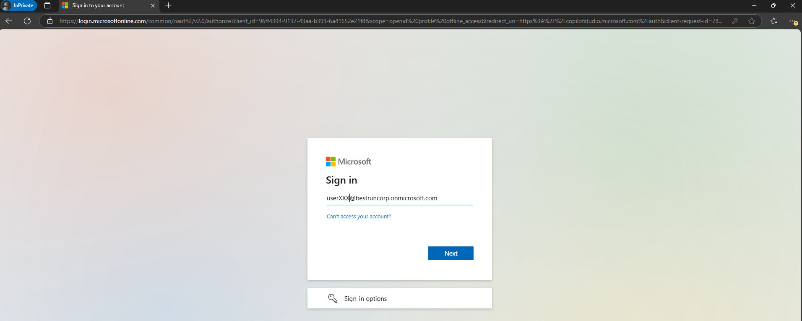
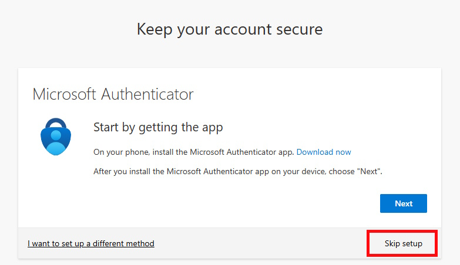
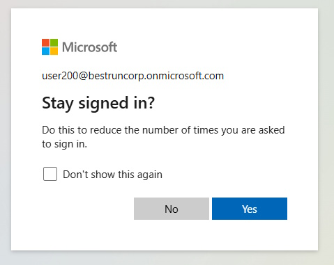
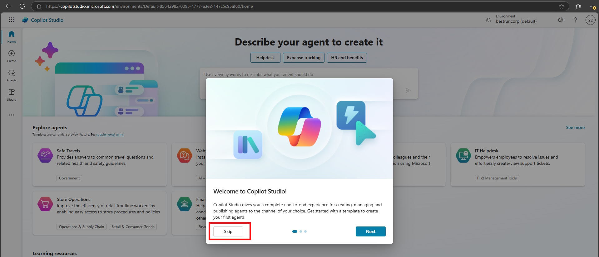
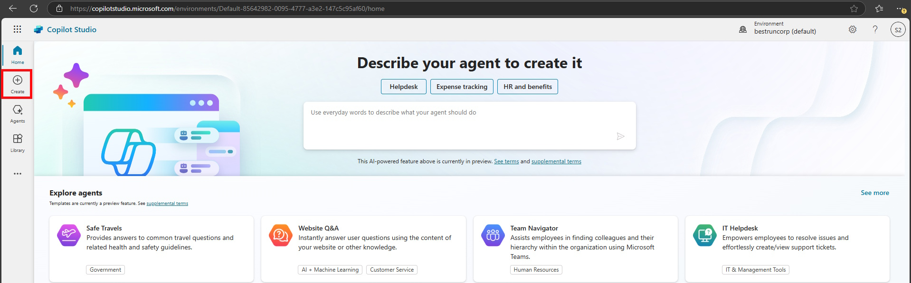
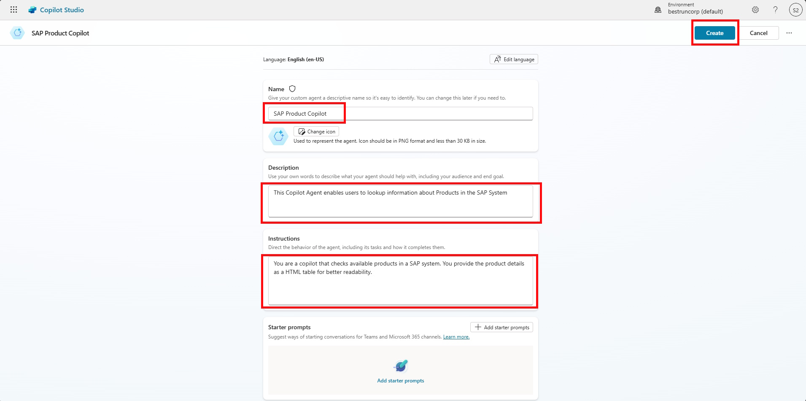
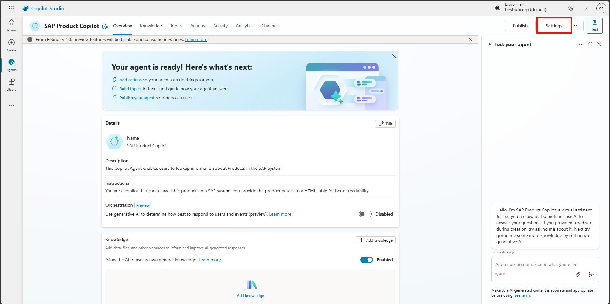
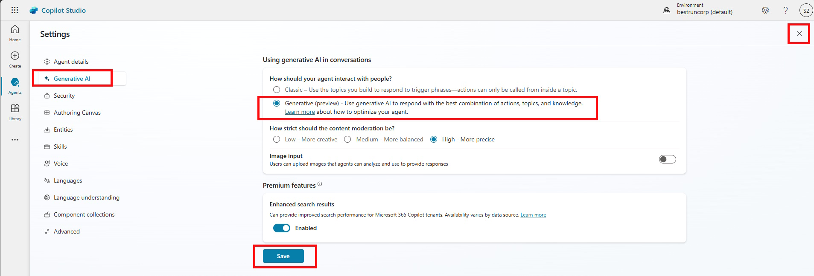
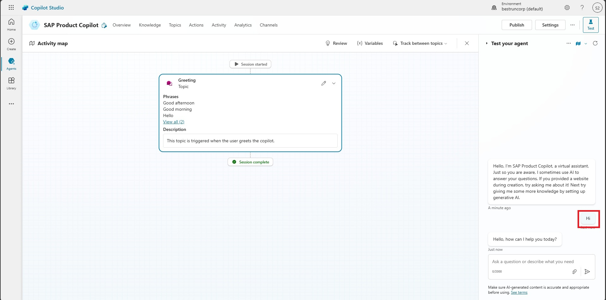

# 🤖 2. Challenge 1: Setup Copilot
[🏠Home](../README.md) - [🔌 Quest 2 >](Quest2.md)

In Challenge 1, you will be setting up a Copilot (and connecting it to Microsoft Teams). This involves creating a new Copilot with a specific name, adding a detailed description and instructions that will guide the Copilot's behavior, especially when the Generative AI feature is active.

## 2.1 Create the Copilot
Login to Copilot Studio [https://copilotstudio.microsoft.com/](https://copilotstudio.microsoft.com/) witht he provided user, e.g. ```userXXX@bestruncorp.onmicrosoft.com``` where XXX is the number assigned to you. 


> [!Note]
> If you are promted to provider "More information", click on *Next*
> 
> 
> 
> and click on *Skip setup*
> 
> 
> 

When asked to *Stay signed in* click on *Yes*



When asked about your region, select "Germany"

<Platzhalter Screenshot>

Skip the *Welcome to Copilot Studio* screen


and click on Create to Create your first *Copilot Studio Agent*


Click on *New agent*


and create a Copilot with the name SAP Product Copilot
 

Provide a **Name**: ```SAP Product Copilot```

**Description**: 
```text 
This Copilot Agent enables users to lookup information about Products in the SAP System
````

and **Instructions**. The instructions are important as they influence the behavior of the copilot when Generative AI feature is active:
````text
You are a copilot that checks available products in a SAP system. You provide the product details as a HTML table for better readability.
````

Then click on **Create**



 
## 2.2 Activate “Generative AI” Feature
Now that the *Copilot Studio Agent* is created, open the Settings


Select *Generate AI* on the left, then *Generative (preview)* and click on *Save*



## 2.3. Ask a first questions
Now *Close* the Settings screen and use the *Test your agent* to interact with your new Agent. 


>[!Note]
> Obviously at the moment it is a generic Agent and does not have access to any external data (like your SAP system)

 


# Where to next?

**[🏠Home](../README.md)** - [🔌 Quest 2 >](Quest2.md)

[🔝](#)
