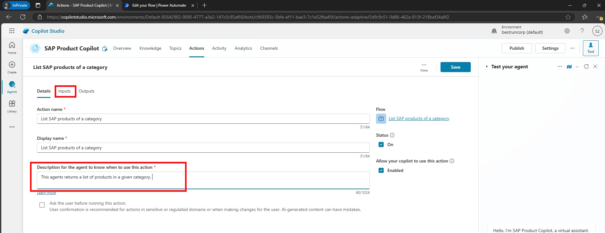

# 🔌 3. Challenge 2: Setup Flow + SAP OData Connector
[< 🤖 Quest 1](Quest1.md) - **[🔧 Quest 3 >](Quest3.md)**

In Challenge 2, we will setup a Power Automate flow and connect it to an SAP OData Connector. This involves creating a new flow, where we will add an SAP OData action, specifically choosing to query OData entities in SAP.

## 3.1 Create the Power Automate Flow
In Copilot Studio, go to Actions and Click on *+Add an Action*


Click on *New Action* and select *New Power Automate flow*

 
> [!Note]
> If you are getting the pop-up to provide *More Information* click on *Next* and *Skip Setup* like in the previous Quest. 

First thing is to rename your Flow. Click on *Run a flow from Copilot* and provide a new name ````List SAP products of a category````


<!-- > [!Note]
>It might be the case that the UI you see looks different compared to the screenshots. In case you want to have the same look and feel, then you can turn off the 'New designer' with the toggle button on the top right. -->

[!Note]
> Make sure that the **New designer** experience is enabled in your user session.
> 

Select the first step of your flow (*Run a flow from Copilot*) and click on *+ Add an input*. From there select *Text*
<!--  -->


Now provide a variable name for this input field ````Category```` 
<!--  -->


Now that we will get a Category from as an input we can call the SAP OData Service. Click on the *+* sign between the *Skills* and the *Respond to Copilot* actions and select *Add an action*
<!--  -->


Search for SAP OData and select the *Query OData entities*  
<!--  -->


 
Provide the following properties:
|Name|Value|
|----|-----|
|Connection name|PM0-100-GWSAMPLE|
|OData Base URI|https://microsoftintegrationdemo.com:44300/sap/opu/odata/iwbep/GWSAMPLE_BASIC?sap-client=100|
|Username|userXXX|
|Password|\<as provided\>|


> [!Note]
> If you are using SAP's Public Demo system *ES5*, then OData Base URI: https://sapes5.sapdevcenter.com/sap/opu/odata/iwbep/GWSAMPLE_BASIC


From the *OData Entity name* drop down select *ProductSet*


Click *Show all* and select Power FX icon from the $filter to enter a query:


Add this expression: 
````text
concat('Category eq ', '''', triggerBody()['text'], '''')
````
and click on *Add*

 

The final action *Respond to Copilot* will return the list of products from SAP. Select the *Respond to Copilot* action and then *+Add an output* on the left hand side 


As before select *Text* 

 
Provide a name for this new parameter, e.g. ````ProductsForCategory```` and click on the *Enter a value to respond with* field to be able to select the flash sign:


From the list of properties select *Body* from *Query OData entities*


For the *Enter a description of the output* enter 
````text
Products found in SAP of a given category. Present the result as HTML table including following information: ProductID; Name; Category; Description; Supplier; Price; Currency.
````
<!--  -->


Now publish your flow before we head over to the first test.


## 3.2 Test the flow
To test the Flow, click on Test. Choose Manually and select *Publish & Test* 


For the *Category* enter product ID ````Keyboards````  and click on *Run flow*


> [!Note]
> If you are seeing an error like this, just click on *Return to classic designer* and run the test again. 
> 
> 


Track the flow execution by going to the ````Flows Runs Page````


and then browse to your most recent flow exection by clicking the first link.


From the successful run one would normally take out the output body for later use in the copilot studio as input schema for the JSON parsing. In this lab, however, we provide the schema directly to save some time.
<!--  -->


> [!Important]
> Make sure to doublecheck that you renamed the flow to *List SAP products of a category*
 
## 3.3 Connect the Copilot with the Flow
Go back to the Copliot Studio window and click on *Refresh*


> [!Note]
> If this windows is gone, just click on *Actions* -> *Add Actions* again and search for the flow that you had previously created. 
 
Chose the previously created Flow *List SAP products of a category*


For now just click on *Add action*


Under Actions you should now see the Action that was just created. Click on it.


Enter the *Description for the agent to know when to use this action* 
````text
This agents returns a list of products in a given category. 
````
and click on *Inputs*



Under the *Inputs* tab, add the following text into the Description box so that Gen AI knows how to set the input for the flow:

````text
Product Category. Only one single category can be chosen as input from this list. It is case-sensitive and must be written exactly like below: Accessories, Notebooks, Laser Printers, Mice, Keyboards, Mousepads, Scanners, Speakers, Headsets, Software, PCs, Smartphones, Tablets, Servers, Projectors, MP3 Players, Camcorders
```` 


Now Save your agent.

## 3.4 Test the Copilot in the test pane
Open the Test pane and give it a try by asking: 
````text
show me keyboards in the system
````

For the first test you need to connect with the SAP OData Connector. Click on *Connect*


Click on *Connect*


And *Submit*


Go back to the Copilot Studio tab and click on Retry. As a result you should see an HTML table with Keyboards from the SAP system. 


# Where to next?

**[🤖 Quest 1](Quest1.md) - [🔧 Quest 3 >](Quest3.md)

[🔝](#)
