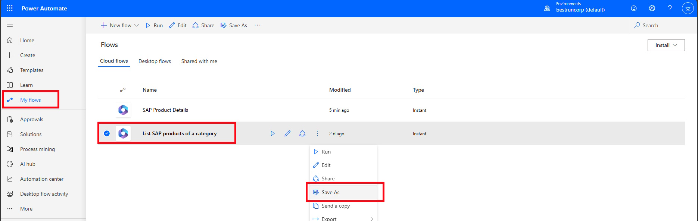
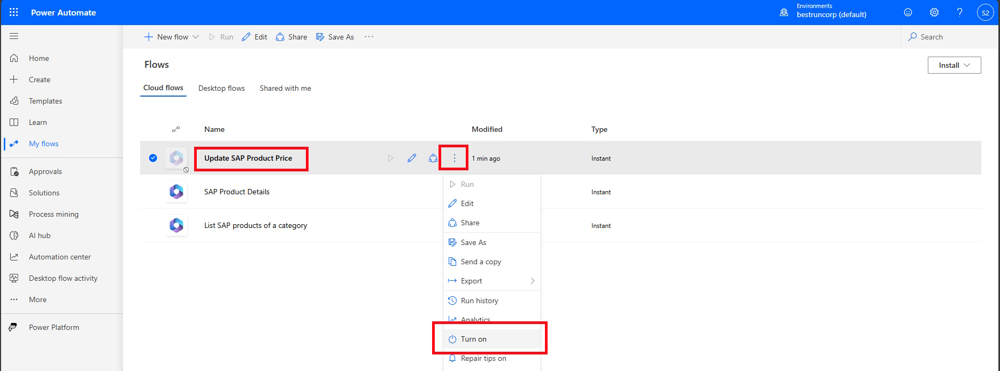
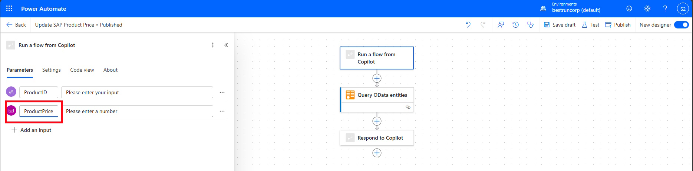
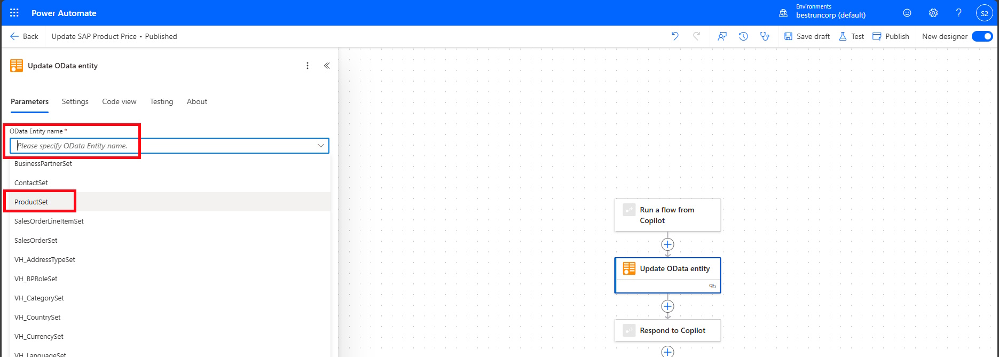
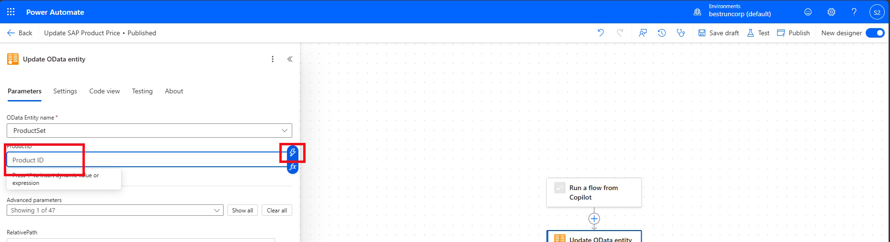
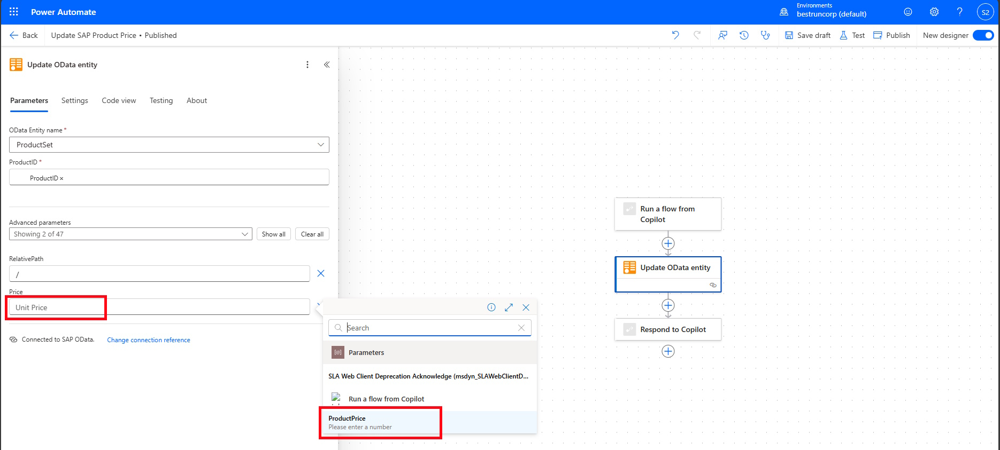
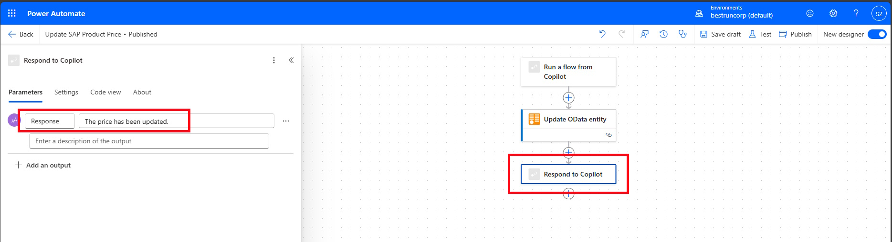
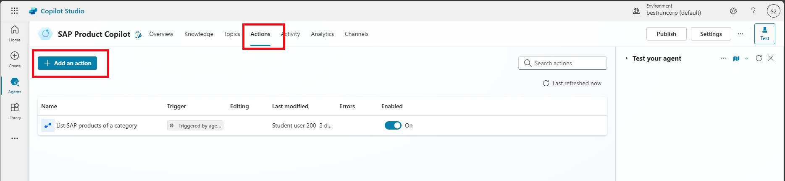
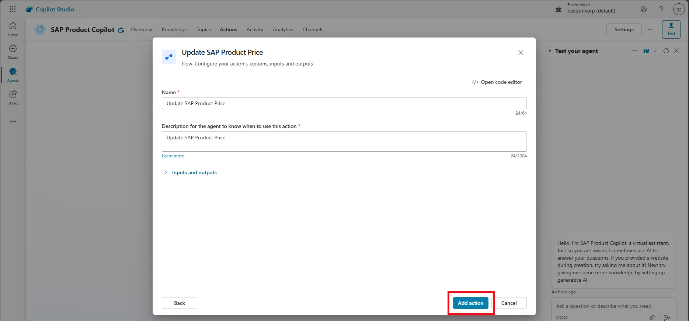
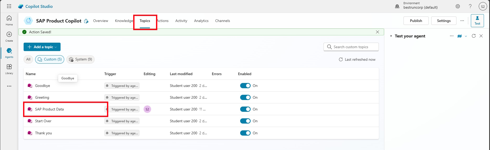

# 🔧 4. Challenge 3: Change data in SAP
[< 🔌 Quest 2](Quest2.md) - **[Quest 4 >](Quest4.md)**

In this challenge you will learn how to:
* The difference between Actions and Topics.
* Create a topic to handle more complex tasks like updating data in SAP.
* How topics will be activated with the right trigger phrases.
* Call flows from topics.
* Use other entities of the SAP OData Connector
* Handle special situations (e.g. no product found)
* Parse JSON and assign values to topics variables

For the sake of time and simplicity, we keep the hand-on session simple and only provide the possibility to update the price.

## 4.1 Create necessary flows in advance
### 4.1.1 Create flow to read SAP Product Details
The first flow that we are going to create will retrieve all detailed information about the product from the SAP System. 


Go to the browser window with Power Automate. (e.g. open [Power Automate](https://make.powerautomate.com/) and click on *My flows*)


Click on the *three dots* for the *Last SAP products of a category* and select *Save as* to create a copy of the existing flow. 


Provide a new *Flow name*, ````SAP Product Details```` 


Refresh the browser to see the newly created *SAP Product Details* flow. Click again on the *three dots* and select *Turn on* to active the flow


Make sure that the *SAP Product Details* flow is select and click on the *Pencil* to edit the flow. 


Click on the *Run a flow from Copilot* trigger and change the name of the Parameters *Category* to ````ProductID````


In order to filter now for ProductID, select the second step, *Query OData entities*, Click on the $filter value and change the text to 
````javascript
concat('ProductID eq ', '''', triggerBody()['text'], '''')
````
and click on *Update*


In the last action *Respond to Copilot* change the Parameters to ````ProductDetails```` and use the description: 
````text
Return details for a given product ID
````
and click on the *Flash* icon and add
````json
outputs('Query_OData_entities')?['body/data']
````


Then click on *Publish* to save and Publish the flow. 

### 4.1.2 Create flow Update SAP Product Price
Now we create another flow called *Update SAP Product Price* as another copy of the first flow *List SAP products of a category*. Click on *Back* and *My flow* to *Save as* the *List of SAP Products of a category* flow 

 
Enter the name *Update SAP Product Price* and click on *Save*


 As before refresh the browser, select the *three dots* for the *update SAP product Price* flow and click on *Turn On* 


Having the flow selected click on *Edit*


Similar as before, select the trigger action *Run a flow from Copilot* and change the first parameter name to *ProductID*. Then click on *+ Add an input* to add another paraemter for the new Price. 


Select Number


Change the name to ````ProductPrice````


Now delete the second action *Query OData enttities*, by secting it, and clicking on *Delete* in the *three dots* menu


If prompted confirm the deletion


Now click on the *+* between the *Run a flow from Copilot* and *Respond to Copilot* actions and search for ````OData````. From the list select *Update OData Entity*


From the drop down list under *OData Entity name*  


Select the *ProductID* field and click on the *Flash* symbol


From the drop-down select *ProductID*


In this workshop we are only going to update the price of the product. 
From the *Advaned parameters* drop down, select *Price*

 

Select the *Price* field and as before clicking on the *Flash* symbol, select *ProductPrice* from the drop down


In the last step *Respond to Copilot* hard code a *Response* *The price has been updated*


Now *Publish* the flow again. 


### 4.2 Create a Topic “SAP Product Data”
Now go back to the [Copilot Studio window ](https://copilotstudio.preview.microsoft.com/) and click on *Topics* From there click on *+ Add a topic* -> *From blank*


In the section *Describe what the topic does* enter the following:

````text 
This topic will fetch details of a product in SAP and allows the user to update SAP product information.
Typical queries are like these:
Update / change or edit product price in SAP.
Save the Topic
````


Click on Details to change more properties of this Trigger. 
*Name*: ````SAP Product Data````
*Description*: ````Show and update information about a product in the SAP system. ````


 
Click on the *Input* tab and select *Create a new variable*


Change the *Variable name*  to ````ProductID````, add the text ````Product ID. Example: HT-1000.```` in the description and click on *Save*


Click on the "+" under the *Trigger* and selec *Ask a question*


Add the following text 

````text
Which product do you want to update? Please provide the Product ID. Example: HT-1000.
````


In the *Identify* field choose *User’s entire response*

 
For the *Save user resposne as* select the variable *ProductID*

 

> [!Note]
> With GenAI feature enabled the question might not be asked when the ProductID is already known within the context of the conversation, which is very convenient. For this the variable must have the “receive values from other topics” check box activated.
> 
 
## 4.3 Add the flow to read SAP product details
Click on the *+* after the question and from *Add an action* select the previously created *SAP Product Details* Power Automate flow


In the action, click on *Power Automate inputs (1)* and select the variable *ProductID*


 
## 4.4 Parse the data returned by the Flow
Now we need to parse the results of the Power Automate flow. For this click on the *+*, select the *Variable management* and click on *Parse value*


In the *Parse value* section, select the *ProductsForCategory* output


For *Data type* select *Table*

 

Under *Save as* click on *Select a variable* and click on *Create a new variable*:

 
Go into the Var1 “View details” to change the name to ````Product```` and select *Receive values from other topics*


  
The schema needs to be generated or provided. Here, we are providing it to speed up the hands-on session. Click on *Edit schema*


Copy/paste the following text into the *Edit schema* box and click on *Confirm*
````text
kind: Table
properties:
  Category: String
  ChangedAt: String
  CreatedAt: String
  CurrencyCode: String
  Depth: Number
  Description: String
  DescriptionLanguage: String
  DimUnit: String
  Height: Number
  MeasureUnit: String
  Name: String
  NameLanguage: String
  Price: Number
  ProductID: String
  SupplierID: String
  SupplierName: String
  TaxTarifCode: Number
  ToSalesOrderLineItems:
    type:
      kind: Record
      properties:
        AssociationLinkUrl: Blank
        IsCollection: Boolean
        Name: String
        Url: String

  ToSupplier:
    type:
      kind: Record
      properties:
        AssociationLinkUrl: Blank
        IsCollection: Boolean
        Name: String
        Url: String

  TypeCode: String
  WeightMeasure: Number
  WeightUnit: String
  Width: Number
  ````


## 4.5 Add Question about required change
Now that we have the product details, we want to offer an option to update the price. As before, click on the *+* and select *Add a question*.


 
Add a question node like this with:
* Question text: ````Placeholder, we'll add details via code editor. The details of the question will be added using the code editor subsequently.````
* Identify *User’s entire response* and


* Save users response as variable ````ChangeRequest```` and click on *Save*:


 
In order to save time, use the code editor to enter the formulas to show the product details and ask the question. Click on the *three dots* / *More* and click on *Open code editor*


 
In the code editor, search for the text Placeholder, we'll add details via code editor. 


 Replace the selected text with this block of text:
 
 ````text
      |-
        The product information in SAP are as follows:
        - **Product ID:  {Topic.ProductID}**
        - **Name:**  {LookUp(Topic.Product, ProductID = Topic.ProductID).Name}
        - **Description:**  {LookUp(Topic.Product, ProductID = Topic.ProductID).Description}
        - **SupplierID:**  {LookUp(Topic.Product, ProductID = Topic.ProductID).SupplierID}
        - **SupplierName:**  {LookUp(Topic.Product, ProductID = Topic.ProductID).SupplierName}
        - **Category:**  {LookUp(Topic.Product, ProductID = Topic.ProductID).Category}
        - **Price:**  {LookUp(Topic.Product, ProductID = Topic.ProductID).Price}
        - **Currency:**  {LookUp(Topic.Product, ProductID = Topic.ProductID).CurrencyCode}

        What do you want to change?
````


As a result, the question should look like this:


## 4.6 Create another action to update the product price
From the top menu, click on *Action* and select *+ Add an action*


Select the previously crated *Update Product Price* Action


> [!Note]
> You might need to select *Flow* if you do not yet see the required Power Automate flow. 

Leave the defaults and click on *Add action*


Select the newly created *Update SAP Product Price* Action


Click on Inputs and verify the correct configuration of the 2 Inputs as follows (Product ID and Price) and save the action.

 

## 4.7 Add a plugin action to update the price
Go back to the Topic *SAP Product Data*


At the end of the flow (after the *Question* step), click on the *+*, select *Add an action*, select the tab *Action (preview)* and select the newly created Action *Update SAP Product Price*


In the plugin action you don’t need to provide an input because Gen AI will automatically fill in the details into the action input based on the last user input and conversation context.

Save and publish.


## 4.8 Test the price update in Copilot Studio
Start asking Copilot about notebooks
````text
please show me notebooks
````


Next ask for specific details, e.g. 
````text
show me details for HT-8003
````


Since this is a first time connection, we need to authenticate again. Click on *Connect* and for all *Not connected* connections


## 4.9 Publish the final version to Microsoft Teams
 
Restart the agent if necessary:
 
## 4.10 Final test in Teams
 
 
 
 
# Where to next?

**[🔌Quest 2](Quest2.md) - [ Quest 4 >](Quest4.md)

[🔝](#)