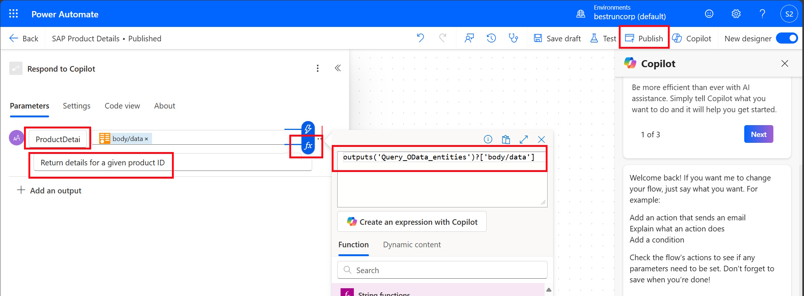

# 🔧 4. Challenge 3: Display data in SAP
[< 🔌 Quest 2](Quest2.md) - **[Quest 4 >](Quest4.md)**

In this challenge you will learn:
* The difference between Actions and Topics.
* How to create a topic to handle more complex tasks like updating data in SAP.
* How topics will be activated with the right trigger phrases.
* How to call flows from topics.
* How to use other entities of the SAP OData Connector
* How to handle special situations (e.g. no product found)
* How to parse JSON and assign values to topics variables

For the sake of time and simplicity, we keep the hand-on session simple and only provide the possibility to update the price.

## 4.1 Create necessary flows in advance
### 4.1.1 Create flow to read SAP Product Details
The first flow that we are going to create will retrieve all detailed information about the product from the SAP System. 


Go to the browser window with Power Automate. (e.g. open [Power Automate](https://make.powerautomate.com/) and click on *My flows*)


Click on the *three dots* for the *Last SAP products of a category* and select *Save as* to create a copy of the existing flow. 


Provide a new *Flow name*, ````SAP Product Details```` 


Refresh the browser to see the newly created *SAP Product Details* flow. Click again on the *three dots* and select *Turn on* to active the flow


Make sure that the *SAP Product Details* flow is select and click on the *Pencil* to edit the flow. 


Click on the *Run a flow from Copilot* trigger and change the name of the Parameters *Category* to ````ProductID````


In order to filter now for ProductID, select the second step, *Query OData entities*, Click on the $filter value and change the text to 
````javascript
concat('ProductID eq ', '''', triggerBody()['text'], '''')
````
and click on *Update*


In the last action *Respond to Copilot* change the Parameters to ````ProductDetails```` and use the description: 
````text
Return details for a given product ID
````
and click on the *Power Fx* icon and add
````json
outputs('Query_OData_entities')?['body/data']
````
 

Then click first on *Add* ...



... and then on *Publish* to save and Publish the flow. 


### 4.2 Create a Topic “SAP Product Data”
Now go back to the [Copilot Studio window ](https://copilotstudio.preview.microsoft.com/), select your ````SAP Product Copilot```` agent and click on *Topics* From there click on *+ Add a topic* -> *From blank*


In the section *Describe what the topic does* enter the following and *Save the Topic*

````text 
This topic will fetch details of a product in SAP and allows the user to update SAP product information.
Typical queries are like these:
Update / change or edit product price in SAP.
````


Click on Details to change more properties of this Trigger. 
*Name*: ````SAP Product Data````
*Description*: ````Show and update information about a product in the SAP system. ````


 
Click on the *Input* tab and select *Create a new variable*


Change the *Variable name*  to ````ProductID````, add the text ````Product ID. Example: HT-1000.```` in the description and click on *Save*


Click on the "+" under the *Trigger* and selec *Ask a question*


Add the following text 

````text
Which product do you want to update? Please provide the Product ID. Example: HT-1000.
````


In the *Identify* field choose *User’s entire response*

 
For the *Save user resposne as* select the variable *ProductID*

 

> [!Note]
> With GenAI feature enabled the question might not be asked when the ProductID is already known within the context of the conversation, which is very convenient. For this the variable must have the “receive values from other topics” check box activated.
> 
 
## 4.3 Add the flow to read SAP product details
Click on the *+* after the question and from *Add an action* select the previously created *SAP Product Details* Power Automate flow


In the action, click on *Power Automate inputs (1)* and select the variable *ProductID*


 
## 4.4 Parse the data returned by the Flow
Now we need to parse the results of the Power Automate flow. For this click on the *+*, select the *Variable management* and click on *Parse value*


In the *Parse value* section, select the *ProductDetails* output
<!--  -->


For *Data type* select *Table*

 

Under *Save as* click on *Select a variable* and click on *Create a new variable*:

 
Go into the Var1 “View details” to change the name to ````Product```` and select *Receive values from other topics*


  
The schema needs to be generated or provided. Here, we are providing it to speed up the hands-on session. Click on *Edit schema*


Copy/paste the following text into the *Edit schema* box and click on *Confirm*
````text
kind: Table
properties:
  Category: String
  ChangedAt: String
  CreatedAt: String
  CurrencyCode: String
  Depth: Number
  Description: String
  DescriptionLanguage: String
  DimUnit: String
  Height: Number
  MeasureUnit: String
  Name: String
  NameLanguage: String
  Price: Number
  ProductID: String
  SupplierID: String
  SupplierName: String
  TaxTarifCode: Number
  ToSalesOrderLineItems:
    type:
      kind: Record
      properties:
        AssociationLinkUrl: Blank
        IsCollection: Boolean
        Name: String
        Url: String

  ToSupplier:
    type:
      kind: Record
      properties:
        AssociationLinkUrl: Blank
        IsCollection: Boolean
        Name: String
        Url: String

  TypeCode: String
  WeightMeasure: Number
  WeightUnit: String
  Width: Number
  ````


## 4.5 Add Question about required change
Although we are not yet updating the price, we want to display the information nicely and we will get ready to update the price later on. 

Now that we have the product details, we want to offer an option to update the price. As before, click on the *+* and select *Add a question*.


 
Add a question node like this with:
* Question text: ````Placeholder, we'll add details via code editor. The details of the question will be added using the code editor subsequently.````
* Identify *User’s entire response* and


* Save users response as variable ````ChangeRequest```` and click on *Save*:


 
In order to save time, use the code editor to enter the formulas to show the product details and ask the question. Click on the *three dots* / *More* and click on *Open code editor*


 
In the code editor, search for the text ````Placeholder, we'll add details via code editor````. 


 Replace the selected text with this block of text:
 
 ````text
      |-
        The product information in SAP are as follows:
        - **Product ID:  {Topic.ProductID}**
        - **Name:**  {LookUp(Topic.Product, ProductID = Topic.ProductID).Name}
        - **Description:**  {LookUp(Topic.Product, ProductID = Topic.ProductID).Description}
        - **SupplierID:**  {LookUp(Topic.Product, ProductID = Topic.ProductID).SupplierID}
        - **SupplierName:**  {LookUp(Topic.Product, ProductID = Topic.ProductID).SupplierName}
        - **Category:**  {LookUp(Topic.Product, ProductID = Topic.ProductID).Category}
        - **Price:**  {LookUp(Topic.Product, ProductID = Topic.ProductID).Price}
        - **Currency:**  {LookUp(Topic.Product, ProductID = Topic.ProductID).CurrencyCode}

````


As a result, the question should look like this:


## 4.6 Test the lookup of products in Copilot Studio
Start asking Copilot about notebooks
````text
please show me notebooks
````


Next ask for specific details, e.g. 
````text
show me details for HT-8003
````


Since this is a first time connection, we need to authenticate again. Click on *Connect* and for all *Not connected* connections


## 4.7 Done
 
Congratulations! You were able to create a Copilot that allows you to interact with an SAP system. If you still have time, continue with Question 4 and create an update process. 
 

 
# Where to next?

**[🔌Quest 2](Quest2.md) - [ Quest 4 >](Quest4.md)

[🔝](#)
