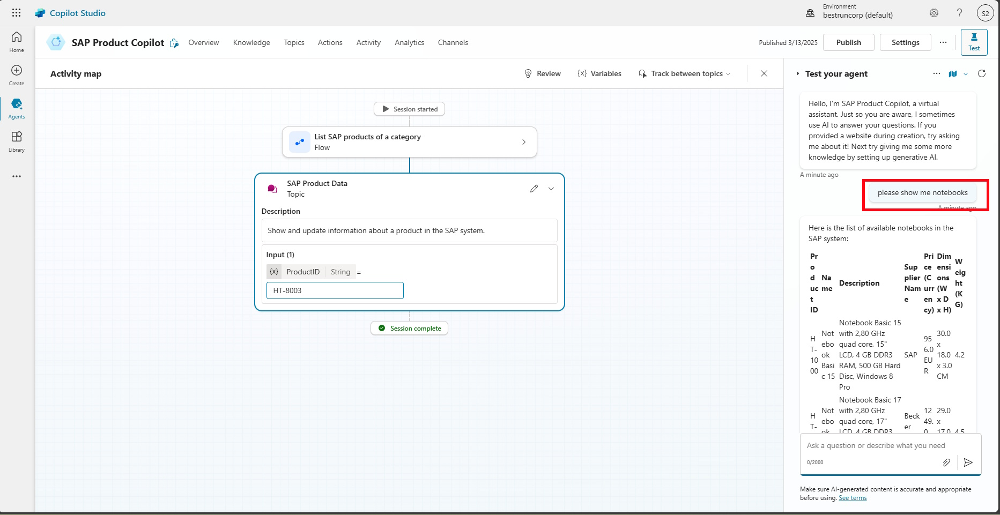

# 🔧 4. Challenge 4: Change data in SAP
[< 🔌 Quest 3](Quest3.md) 
## Option: Updating prices
After displaying the information of a specific product in Copilot Studio, we now want to enhance the flow and add the functionality to update a proprties. In the interest of time, we will only do the update for the product price, but obviously this could be done for all other properites as well. 


### 5.1 Create flow Update SAP Product Price
Now we create another flow called *Update SAP Product Price* as another copy of the first flow *List SAP products of a category*. Go to the browser window with Power Automate. (e.g. open Power Automate and click on My flows). The click on *Save as* for the *List of SAP Products of a category* flow 

 
Enter the name *Update SAP Product Price* and click on *Save*


 As before refresh the browser, select the *three dots* for the *update SAP product Price* flow and click on *Turn On* 


Having the flow selected click on *Edit*


Similar as before, select the trigger action *Run a flow from Copilot* and change the first parameter name to *ProductID*. Then click on *+ Add an input* to add another paraemter for the new Price. 


Select Number


Change the name to ````ProductPrice````


Now delete the second action *Query OData enttities*, by secting it, and clicking on *Delete* in the *three dots* menu


If prompted confirm the deletion


Now click on the *+* between the *Run a flow from Copilot* and *Respond to Copilot* actions and search for ````OData````. From the list select *Update OData Entity*


From the drop down list under *OData Entity name*  


Select the *ProductID* field and click on the *Flash* symbol


From the drop-down select *ProductID*


In this workshop we are only going to update the price of the product. 
From the *Advaned parameters* drop down, select *Price*

 

Select the *Price* field and as before clicking on the *Flash* symbol, select *ProductPrice* from the drop down


In the last step *Respond to Copilot* hard code a *Response* *The price has been updated*


Now *Publish* the flow again. 


## 5.2 Create another action to update the product price
Now that we have the flow created, lets create an *Action* which calls our Power Automate flow. 

From the top menu, click on *Action* and select *+ Add an action*


Select the previously crated *Update Product Price* Action


> [!Note]
> You might need to select *Flow* if you do not yet see the required Power Automate flow. 

Leave the defaults and click on *Add action*


Select the newly created *Update SAP Product Price* Action


Click on Inputs and verify the correct configuration of the 2 Inputs as follows (Product ID and Price) and save the action.

 

## 5.3 Add a plugin action to update the price
Go back to the Topic *SAP Product Data*


At the end of the flow (in the *Questions* step), add a last line in the input field:
````text
What do you want to change?
````

After the *Question* step, click on the *+*, select *Add an action*, select the tab *Action (preview)* and select the newly created Action *Update SAP Product Price*


In the plugin action you don’t need to provide an input because Gen AI will automatically fill in the details into the action input based on the last user input and conversation context.

Save and publish.


> [!Note]
> Don't be confused if it says that the input field must be filled. Just click on Save

## 5.4 Test the price update in Copilot Studio
As before start asking Copilot about notebooks
````text
please show me notebooks
````



Next ask for specific details, e.g. 
````text
show me details for HT-8003
````


Since this is a first time connection, we need to authenticate again. Click on *Connect* and for all *Not connected* connections


Now do an update...
````text
Please update the price to XX USD
````

> [!Note]
> You can open a new browser tab and query the product to check whether the price has been updated by querying the Odata service. Use following URL: https://microsoftintegrationdemo.com:44300/sap/opu/odata/iwbep/GWSAMPLE_BASIC/ProductSet('HT-8003') 

 
# Where to next?

**[🔌Quest 2](Quest3.md)

[🔝](#)
