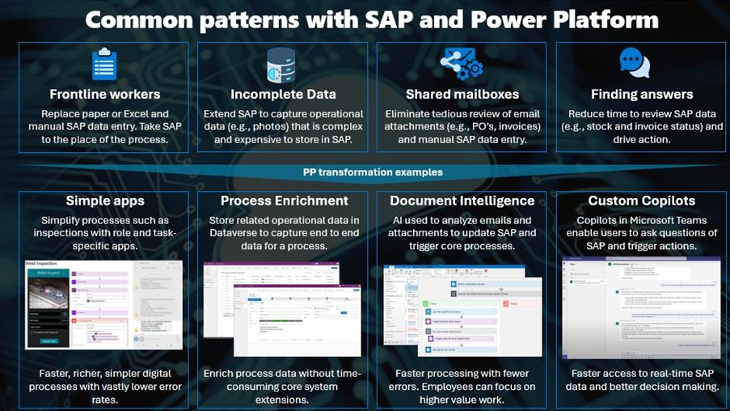

# Copilot Studio & SAP Building Autonomous Agents
** [🤖 Quest 1 >](student/Quest1.md)

## 1. Introduction
Welcome to the DSAG TechXChange 2025 Hands-on lab. This document provides an overview of the Hands-on activities, challenges, and resources available to participants.

### 1.1. Business Scenario
Customers can enhance their SAP systems by integrating Power Platform and AI, enabling them to address a variety of business needs across different use cases. This integration allows for greater flexibility, automation, and intelligent insights, ultimately improving operational efficiency and decision-making.

 
#### Example
1.	**Frontline Workers** - want a simple experience to complete tasks, often relying on mobile apps like inspections. However, many SAP processes are incomplete or inefficient, lacking mobile-friendly solutions. This results in workarounds like paper, Excel exports, and emailed screenshots, introducing data accuracy risks and inefficiencies. With PP, task-based inspection apps can be quickly developed using device features (camera, GPS, etc.) and integrated with SAP via BTP or the SAP Core, creating a faster, simpler process with fewer errors.
2.	**Finding answers** - There’s lots of situations that employees need quick access to SAP data such as stock levels, payment status, HR data and maintenance progress. However, often this is a time-consuming user experience and not always available on the device of choice. The opportunity with PP and Copilot Studio is to introduce a conversational experience in working with SAP where the user can ask questions in natural language to get the insights they need. What’s more, these Copilots can be surfaced in Teams, web pages and Power Apps. With pro-dev support these Copilots can also add actions to update SAP data which adds a whole new dimension to how SAP can be used.

In this lab, you will develop a solution to help employees easily access product information from SAP and also change product prices (write back) in SAP.

### 1.2 Getting ready for the lab
#### 1.2.1 Locate credentials for accessing the provided SAP system
* SAP system: PM0 

SAP credentials to connect to the SAP system PM0 will be provided later in this guide when you need to create a connection.

> [!Tip] 
> If you run through this guide after the TechXChange event, you can also leverage the public [SAP Gateway Demo System](https://developers.sap.com/tutorials/gateway-demo-signup.html)

#### 1.2.2. Locate Entra-ID / Active Directory credentials
* Locate Entra-ID / Active Directory credentials provided in the resources section of this guide. You will need these to sign into Copilot Studio, Power Platform and Microsoft Teams.

#### 1.2.3. Power Platform
* Sign in to Copilot Studio and start free trial here:
[Copilot Studio](https://copilotstudio.microsoft.com/)

> [!Note]
> If you encounter an error starting the trial, you will need to hit "Retry" button a couple of times.
 

## Where to next?

** [🤖 Quest 1 >](student/Quest1.md)

[🔝](#)
