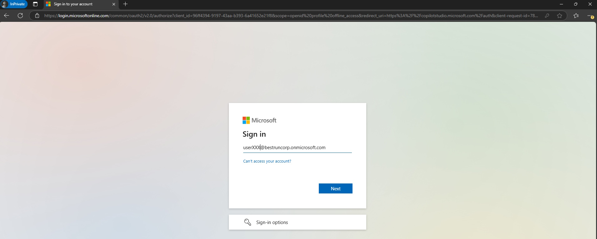
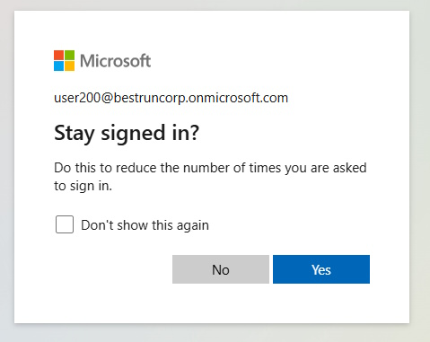
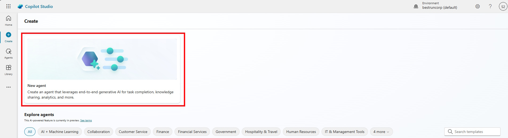
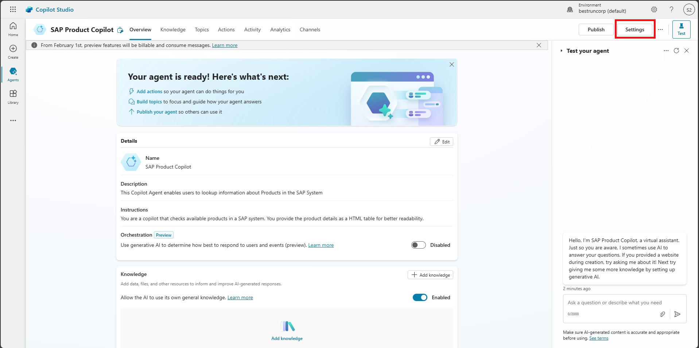
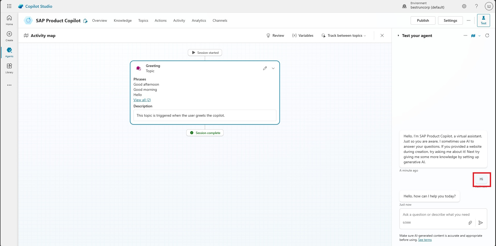

# 🤖 1. Quest 1: Setup Copilot
[🏠Home](../README.md) - [🔌 Quest 2 >](Quest2.md)

In Challenge 1, you will be setting up a new Autonomous Agent. This involves creating a new Copilot in Copilot Studio. We will evolve the agent over the other Quests, expand the instructions, add triggers and teach it more tricks.

## 1.1 Create a solution
> The solution will keep all the components of our autonomous agent in one place and would allow seamless staging to other environment.

Login to Copilot Studio [https://copilotstudio.microsoft.com/](https://copilotstudio.microsoft.com/) witht he provided user, e.g. ```userXXX@bestruncorp.onmicrosoft.com``` where XXX is the number assigned to you. 


> [!Note]
> If you are promted to provider "More information", click on *Next*
> 
> 
> 
> and click on *Skip setup*
> 
> 
> 

When asked to *Stay signed in* click on *Yes*



When asked about your region, select *United States* and click on *Start free trial*
> [!Note]
> Please keep *United States* here, because it simplifies a common UI for all participants and some features are currently only available in english 


Skip the *Welcome to Copilot Studio* screen


In Copilot Studio click on *Solutions* on the left or follow this link [https://copilotstudio.microsoft.com/environments/Default-85642982-0095-4777-a3e2-147c5c95af60/solutions](https://copilotstudio.microsoft.com/environments/Default-85642982-0095-4777-a3e2-147c5c95af60/solutions).

Click on **New Solution** and provide a **Display name**: ```Order Information Agent XXX``` where XXX is the user assigned to you (as we are all working on the same environment this makes it a bit easier to find our own ressources later on).
Select `ContosoInc` as the **Publisher** and click **Create**.


## 1.2 Create the Copilot

Go back to the [Copilot Studio Home Screen](https://copilotstudio.microsoft.com/environments/Default-85642982-0095-4777-a3e2-147c5c95af60/home).

Click on Create to Create your first *Copilot Studio Agent*


Click on *New agent*


Provide a **Name**: ```Order Information Agent XXX``` where XXX is the user assigned to you (as we are all working on the same environment this makes it a bit easier to find our own ressources later on)

If you find yourself in a chat experience click on **Skip to configure** on the top right.

Click on the three dots on the top right and select **Edit advanced settings** and select your freshly created solution.


**Description**: 
```text 
This Autonomous Agent replies to User Question around the Ordering Process or specific Orders
````

and **Instructions**. The instructions in Autonomous Agents are very important for Autonomous Agents, as the agent will check after each step what to do next with the help of the instructions. During the next Quests the instructions will grow and reflect the new capabilities of the agent.
````text
You are an autonomous agent that answers question regarding the ordering process and specific orders.
````
>[!Important]
> Please keep the **Language** as `English (en-US)`

Then click on **Create**

 
## 1.3 Activate “Generative AI” Feature
Now that the *Copilot Studio Agent* is created, open the Settings


Select *Generate AI* on the left, then *Generative (preview)* and click on *Save*


## 1.4 Ask a first questions
Now *Close* the Settings screen and use the *Test your agent* to interact with your new Agent. 


>[!Note]
> Obviously we don't want to build a chatbot. Hold your horses young apprentice - we will get there in the next Quest!


# Where to next?

**[🏠Home](../README.md)** - [🔌 Quest 2 >](Quest2.md)

[🔝](#)

