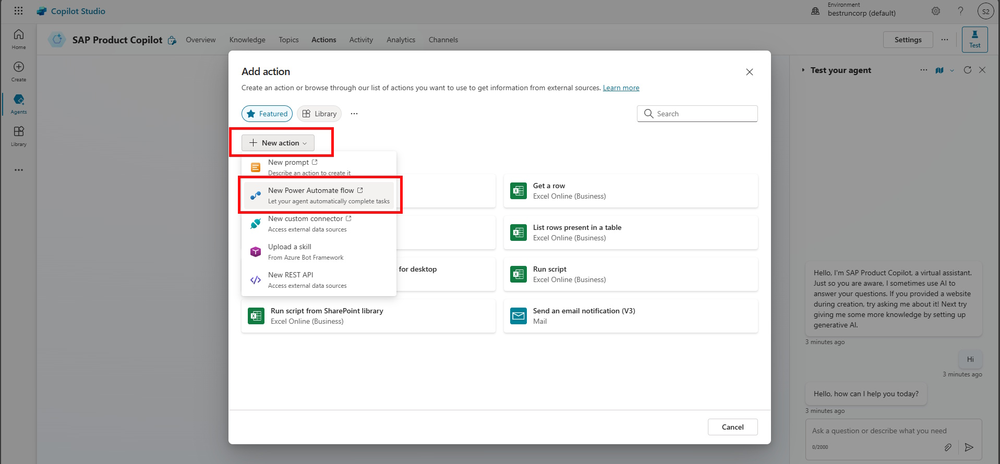
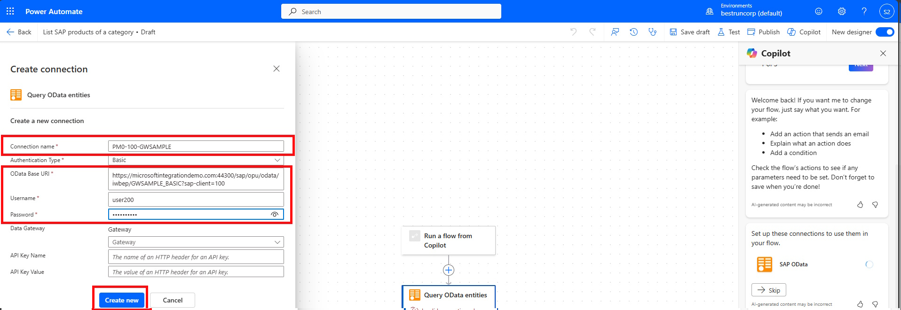
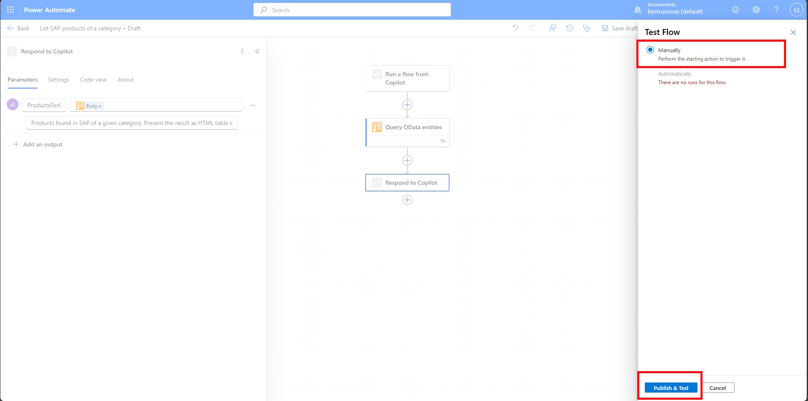
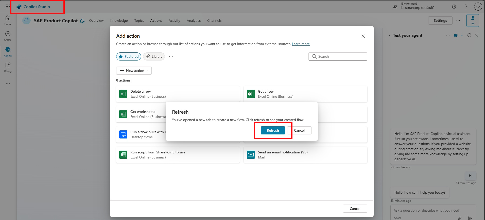
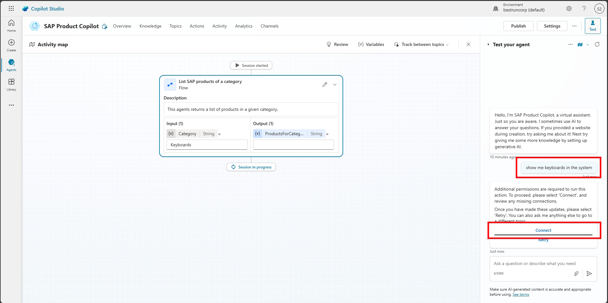

# 🔌 Challenge 2: Setup Flow + SAP OData Connector
[< 🤖 Quest 1](Quest1.md) - **[🔧 Quest 3 >](Quest3.md)**

In Challenge 2, we will make your agent autonomous and add the function to retrieve order information based on the Sales Order ID.

## 2.1 Ask a Question
For all the DSAG participants we will provide a Power App to enter Demo Questions which should eventually trigger our Agent. You can find the [Demo Questions App here](https://org9b8075dc.crm4.dynamics.com/main.aspx?appid=ebcffe1d-a308-f011-bae3-7c1e52fba45f). Please use the provided credentials for your M365 user if prompted to log in.
For this tutorial we don't care where the question actually came from, but the Power Platform also has fantastic capabilities to build a small ticket system and [connect a shared Outlook mailbox](https://learn.microsoft.com/en-us/power-platform/admin/connect-exchange-online).

>[!Note]
> If you do this on your own, either create a SharePoint-list similiar to our app you can use as a trigger. If you already have Power Apps experience you can also build a small Model-Driven App like the one I'll show in the screenshots.

The App provides a view of your Demo Questions with the newest ones on top. All students will enter the questions in the same table, but a security role will make sure everyone only has access to their own questions.


On the top bar you can select **New** which will allow you to ask a new Question.


Enter a new Title and Question everytime you want to test the agent. Our goal for this workshop is, that the agent autonomously sets the **Status Reason** of the question and drafts a **Response** for us.

## 2.2 Add the Trigger
Head back to your agent, locate the **Triggers** section and select **+ Add trigger**.


We will use the *When a row is added, modified or deleted* trigger from Microsoft Dataverse


Rename it to `A new question was created` and hit **Next**.


Provide the following properties:
|Name|Value|
|----|-----|
|Change type|Added|
|Table name|Demo Questions|
|Scope|User|

Select **Create Trigger**


We will configure the trigger a little further directly in Power Automate. Select the three dots next to your newly created trigger and select **Edit in Power Automate**.


When you click on the card **Sends a prompt to the specified copilot for processing** you should see the **message** *Use content from Body*.

This text box is all the information that gets transferred to the agent, so let's use this wisely. As is it will transfer a JSON-object with ALL the information from the created question. 90% of that are internal fields that don't provide actual information. Let's make it specific.

Copy that text into the box:
```text
A new question was added:
<QuestionID>@{triggerOutputs()?['body/contoso_demoquestionid']}</QuestionID>
<QuestionTitle>@{triggerOutputs()?['body/contoso_title']}</QuestionTitle>
<QuestionText>@{triggerOutputs()?['body/contoso_question']}</QuestionText>
```


The only purpose of the xml-tags is to make it easy for the LLM to identify the actual information. We will for example need the GUID of the row to update it later. We will from now on refer to that as QuestionID to reliably get the GUID back from the agent - this will get clearer soon.

## 2.3 Lookup Sales Order Information

Click on *Actions* -> *New Action* and select *New Power Automate flow*

 
> [!Note]
> If you are getting the pop-up to provide *More Information* click on *Next* and *Skip Setup* like in the previous Quest. 

First thing is to rename your Flow. Click on *Run a flow from Copilot* and provide a new name ````Lookup Order XXX````

> [!Note]
> Please again name your flow according to your user.

Select the first step of your flow (*Run a flow from Copilot*) and click on *+ Add an input*. From there select *Text*
Now provide a variable name for this input field ````SalesOrderID```` and put that in the description as well.


This will prompt the LLM to extract the Sales Order ID as an input parameter from the incoming Question. With that we can call the SAP OData Service. Click on the *+* sign between the *Skills* and the *Respond to Copilot* actions and select *Add an action*.
Search for SAP OData and select the *Read OData entity*


Provide the following properties:
|Name|Value|
|----|-----|
|Connection name|PM0-100-GWSAMPLE|
|OData Base URI|https://microsoftintegrationdemo.com:44300/sap/opu/odata/iwbep/GWSAMPLE_BASIC?sap-client=100|
|Username|userXXX|
|Password|\<as provided\>|



> [!Note]
> If you are using SAP's Public Demo system *ES5*, then OData Base URI: https://sapes5.sapdevcenter.com/sap/opu/odata/iwbep/GWSAMPLE_BASIC

From the *OData Entity name* drop down select *SalesOrderSet*

Click into the *SalesOrderID* and select *Enter Data from previous step*


Now select the `SalesOrderID` from the trigger.


 
Now we just have to add the response from the action as an output. Click on the **Respond to Copilot** Action and click **+ Add an output**.

Call it `Sales Order`. As a value select *Enter Data from previous step* again and search for `body`. Select the `Body` from the OData action. This will provide the whole JSON response from the API back to the agent.
Also input `Sales Order JSON Response` as a description.


## 2.4 Test the flow
To test the Flow, click on Test. Choose Manually and select *Publish & Test* 



For the *SalesORderID* enter ````0500000006````  and click on *Run flow*


> [!Note]
> If you are seeing an error like this, just click on *Return to classic designer* and run the test again. 
> 
> 

> [!Important]
> Make sure to doublecheck that you renamed the flow to *List SAP products of a category*

## 2.5 Set the connection for your autonomous flow runs
For your flow to work in autonomous runs we have to make sure it always takes the connection from the user that created the flow.
Go to [Power Automate](https://make.powerautomate.com) and select **My flows**.


Next to **Run only users** hit **Edit**


Under **SAP OData** select the option that is **NOT** `Provided by run only user`.

 
## 2.6 Connect the Copilot with the Flow
Go back to the Copliot Studio window and click on *Refresh*


> [!Note]
> If this windows is gone, just click on *Actions* -> *Add Actions* again and search for the flow that you had previously created. You have to probably refresh again for your new flow to appear.


For now just click on *Add action*. You should now see the Action that was just created, or you can search for your user number.


It should now be added under Actions. Click on it.

Remove your User number from the **Action name** and **Display name** and enter the *Description for the agent to know when to use this action* 
````text
Lookup Order when a Sales Order ID is provided in the question.
````


Under the *Inputs* and *Outputs* tab, the Descriptions we entered in the Power Automate editor should already be provided.

Now Save and publish your agent.

## 2.7 Test the Copilot in the test pane
Open the Test pane and give it a try by asking: 
````text
When was the order 0500000003 created and how much does it cost?
````
> [!Note]
> You might have to connect first
>
>
>
>Click on *Connect*
>
>
>And *Submit*
>
>
>Go back to the Copilot Studio tab and click on Retry.  
>

The screen should jump to the activity tab and execute the *Lookup Order* Flow with the extracted *SalesOrderID* as an input and the JSON as an output.

# Where to next?

We haven't created an action to actually respond to the question. Let's find out in the next quest how to do that!

**[🤖 Quest 1](Quest1.md) - [🔧 Quest 3 >](Quest3.md)

[🔝](#)
