# 🔧 3. Quest 3: Finally respond and add some knowledge
[< 🔌 Quest 2](Quest2.md) - **[Quest 4 >](Quest4.md)**

Now we will finally create a response to the incoming question. We will store that response on the same row of the database where we saved the question.

We will also provide some knowledge to the bot in the form of an FAQ pdf to make the agent a bit more versatile.

## 3.1 Create response flow
As in *Quest 2* we will create a new flow:

Go to **Actions** -> **+ Add an action** -> **New action** -> **New Power Automate Flow**

As soon as you are back in the editor, rename it to `Answer Question XXX` (you may have guessed it - XXX is for your user number).

We need 2 Input Parameters, both are `text`:
* `Question ID` to find the right row in the database
* `Answer` will be the actual Answer in html format, which the agent has to pass to the flow.

The descriptions for the parameters are:
* `Question ID as provided with the original question`
* `Response to the question. Answer direct, but polite. Use html Formatting to answer the question for lists and tables you might want to use so the answer can directly be sent as an Email`

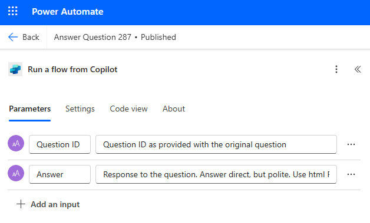

Click on the **+** to add an action between the trigger and the response. Search for `Update a row` and select the one from **Microsoft Dataverse**.

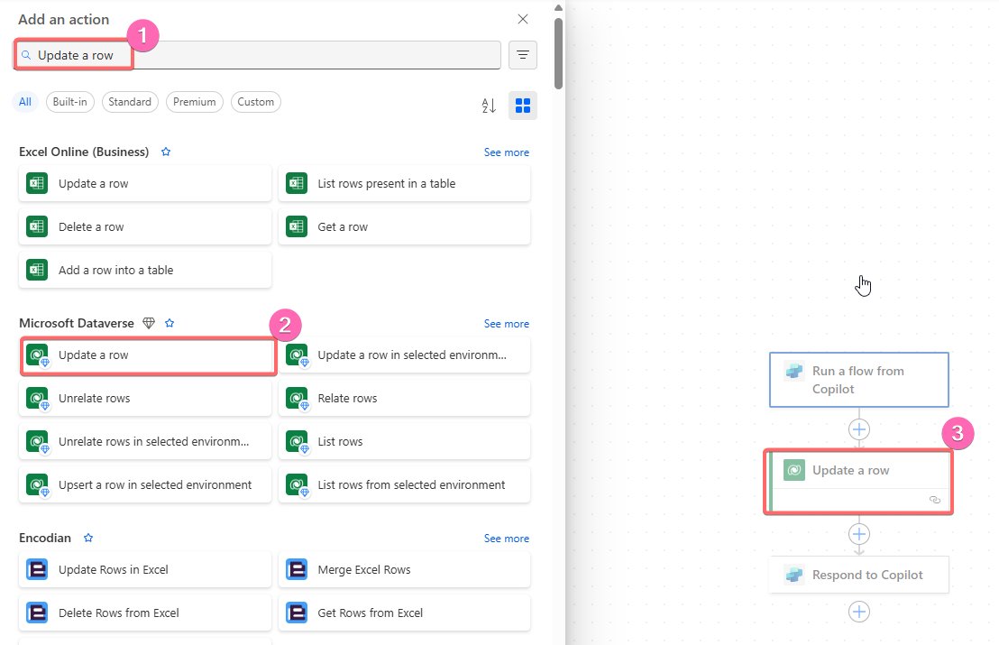

Click on the created action and select the **Table name** `Demo Questions`, provide the **Row ID** with the Input Parameter `Question ID`.

On the bottom select **Show all** adavanced parameters.

Provide the created Input Parameter `Answer` as the **Response**, set teh **Status** to `Inactive` and the **Status Reason** to `Answered Question`.

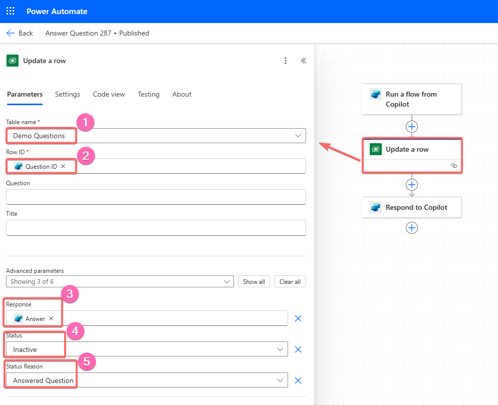

We don't have to provide any output parameters for this flow. Save your flow by clicking on 'Save'/'Save draft' and 'Publish'.

> [!Note]
> If you are not part of the DSAG event, of course you have to provide the answer accordingly to your SharePoint-list or as an answer to an incoming Email, depending how you set your trigger up.

## 3.2 Add the action to your agent

Go back to your agent, refresh and add your flow as an action.
Click on the added action and clean up the **Action name**, **Display name** and add the following **Description**:
`Answer Sales or Sales Order related Question.`

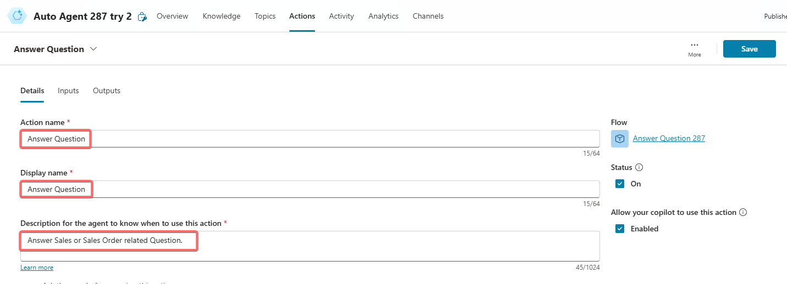

## 3.3 Expand the instructions

Your agent learned a few new tricks. Let's make sure to mention them in the instructions (the knowledge part will follow soon, so let's already add it 😉).

Click on *Overview*. Next to **Details** select **Edit**. For *General instructions* add the following:

You are an autonomous agent that answers question regarding the ordering process and specific orders.

## Actions
You have the following actions and knowledge available to you:
* In the knowledge base there is the Supplier FAQ, so when a frequently asked question is asked by the user make sure to use the knowledge first
* The Action *LookUp Order* will take in the Sales Order ID and return all the information regarding the order
* The Action *Answer Question* will finally respond to the question

## Instructions
Handle the requests the following way:
* When a frequently asked question is asked look into the knowledge base first
* If the Question contains a Sales Order ID or Order ID use the *LookUp Order* action before answering
* In the end use the *Answer Question* action if you found an answer

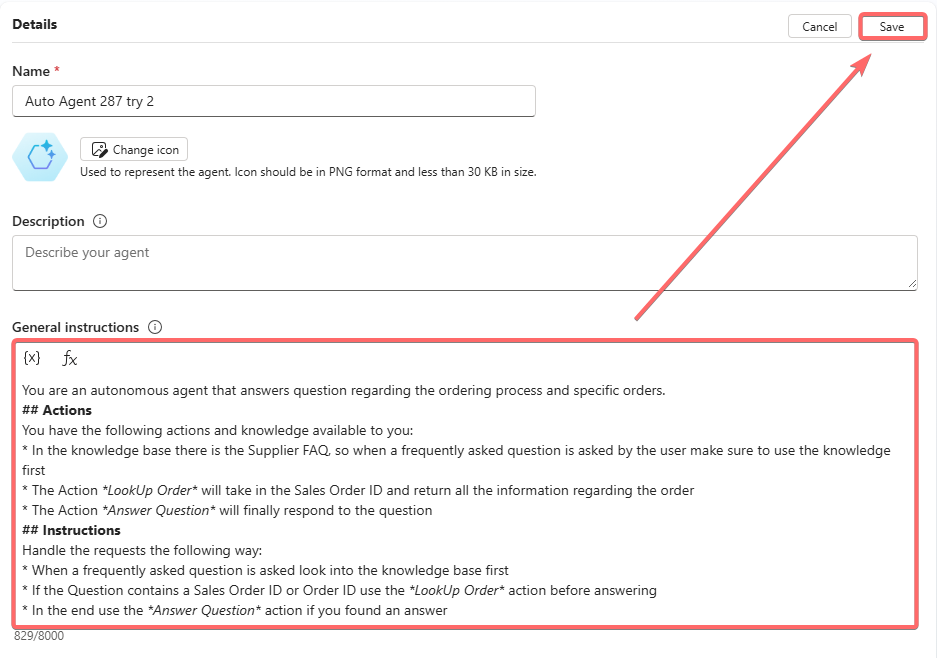

**Save** and **Publish** your agent, to finally try it out!

## 3.4 Test the agent
We will now create a new question in the database. Go to the [Demo Question App](https://org9b8075dc.crm4.dynamics.com/main.aspx?appid=ebcffe1d-a308-f011-bae3-7c1e52fba45f&pagetype=entityrecord&etn=contoso_demoquestion) and ask the following Question.

* Title: `Sales Order Info`
* Question: `When was the order 0500000003 created and how much does it cost?`

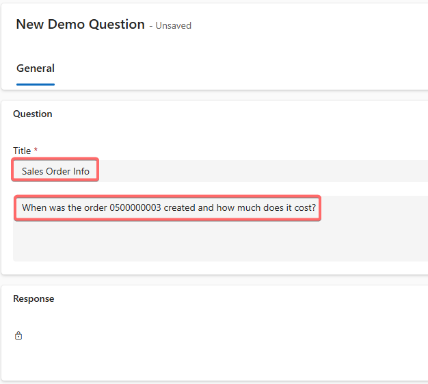

After a minute the agent should trigger.

In th **Activity** tab you should get a new row giving you the information about the agent run.

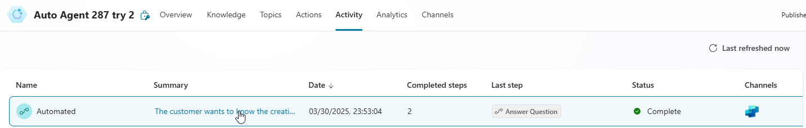

When you click on it the detailed information of the flow run should appear.

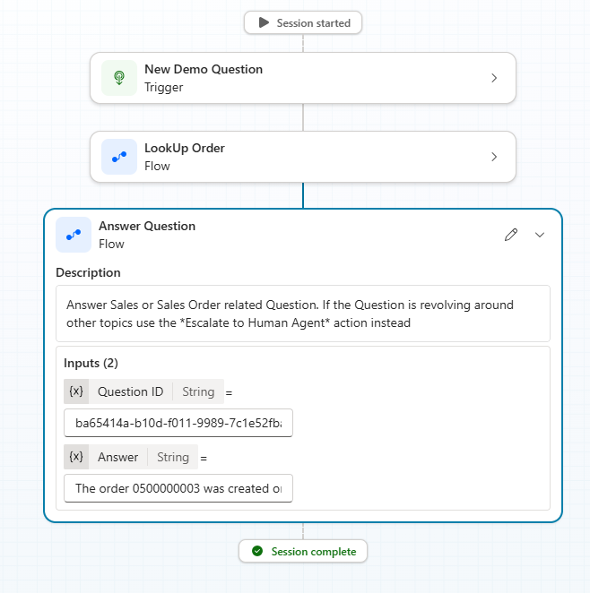

You should also find the answered question in the [Demo App](https://org9b8075dc.crm4.dynamics.com/main.aspx?appid=ebcffe1d-a308-f011-bae3-7c1e52fba45f&pagetype=entitylist&etn=contoso_demoquestion&viewid=bc250d73-3e36-48cd-aca6-63e3894a6533&viewType=1039).

When you click on the title, the response should appear there:

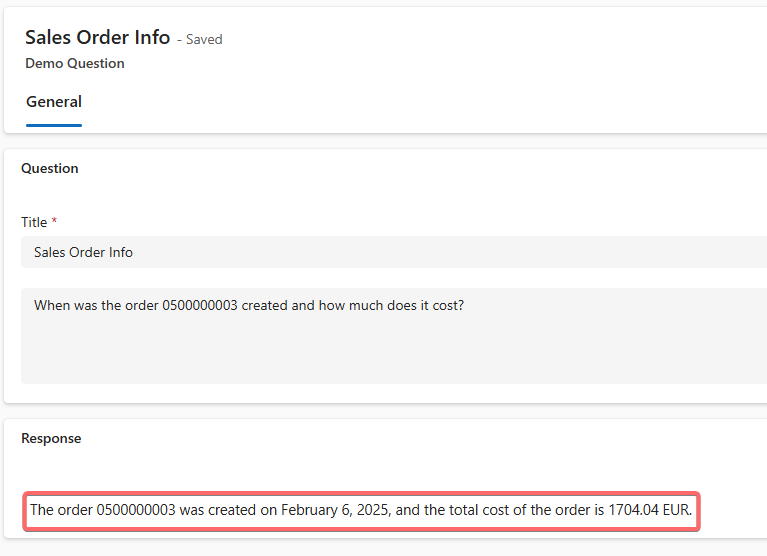

## 3.5 Add knowledge

Download the document [SupplierFAQ.pdf](../documents/SupplierFAQ.pdf) from this repository and upload it as a knowledge source.

In Copilot Studio we can do this in the **Overview** tab in the **Knowledge** section.
Click **+ Add knowledge** and drag and drop the file to the gray area.
Click **Add** 
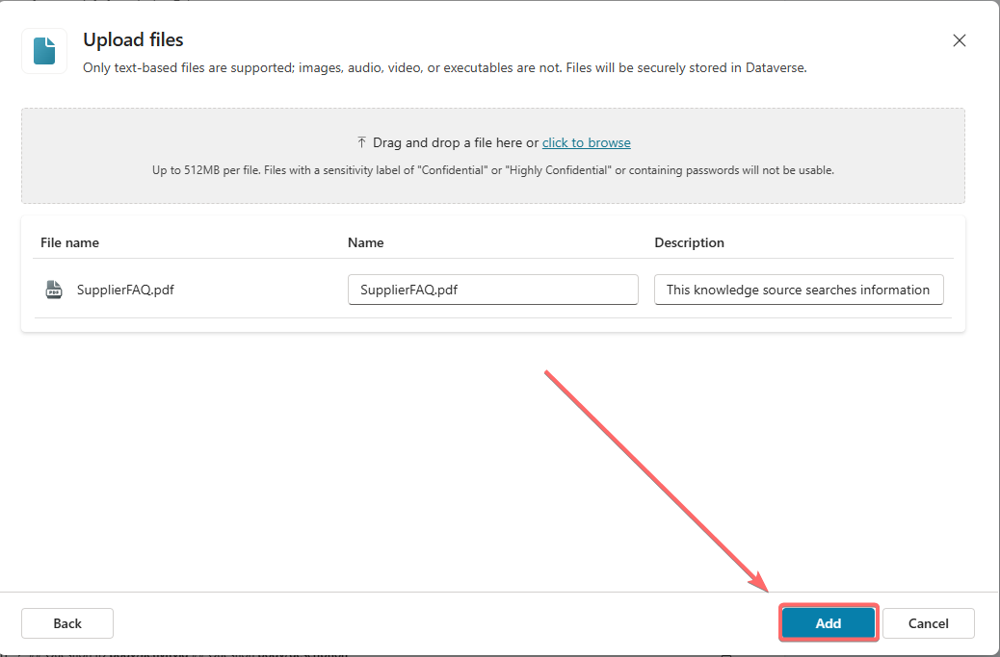

In the **Knowledge** section under **See all** you can see when the file is processed.

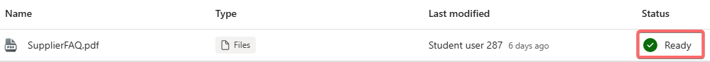

**Save** and **Publish** your agent!

## 3.6 Test again
Let's create a question that will ask for knowledge, as well as a specific order. Go to the [Demo Question App](https://org9b8075dc.crm4.dynamics.com/main.aspx?appid=ebcffe1d-a308-f011-bae3-7c1e52fba45f&pagetype=entityrecord&etn=contoso_demoquestion) and ask the following Question.

* Title: `Mixed Question`
* Question: `What is your return policy and what was the price of the Order 0500000007?`

Your agent should now dynamically look into the knowledge AND Lookup the specific sales order before answering the question.
 
# Where to next?

**[🔌Quest 2](Quest2.md) - [ Quest 4 >](Quest4.md)

[🔝](#)
