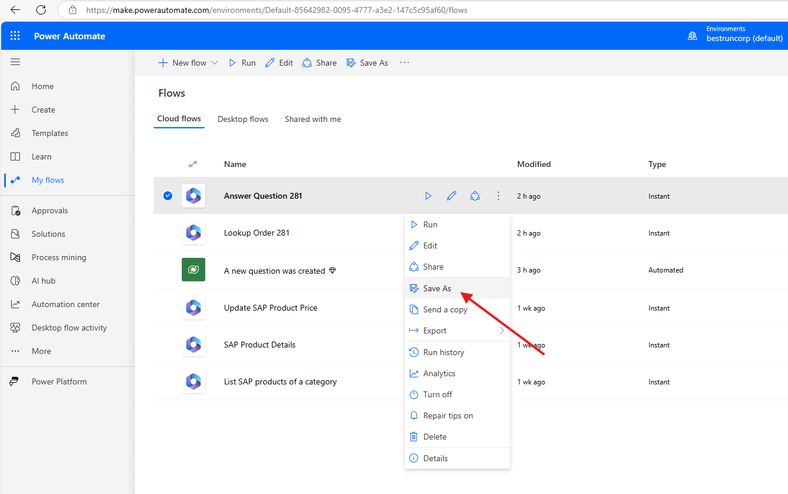
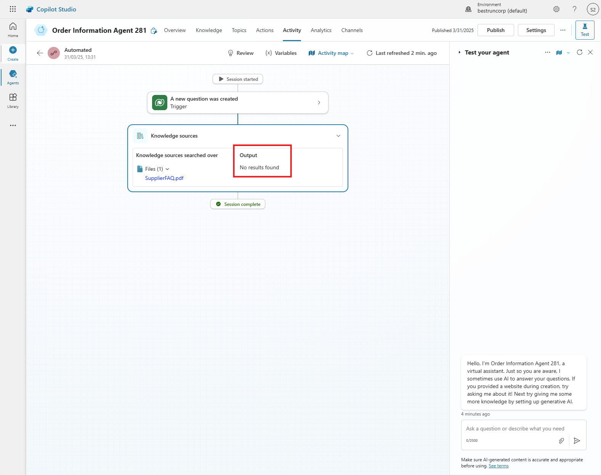

# 🔧 4. Quest 4: Escalate!
[< 🔌 Quest 3](Quest3.md) 

This is your final challenge! What happens, when the bot doesn't have an answer or the question isn't even Sales Order related? We need a way to escalate that request to a human agent!

## 4.1 Create an escalation flow
Create a simple flow, similar to the **Answer Question** flow. Instead of creating an answer it will just set the **Status** and **Status Reason** of the database entry.

You can create a duplicated of the Answer Question flow by choosing the three dots on at the 'My flows' page at Power Automate and click on save as. 


Give it the flow name:
```text
Escalate to Human Agent XXX
```

Here is a hint how that flow may look like:


## 4.2 Become one with the prompt!
Of course your instructions need to reflect the new capabilities of your agent. Tell the agent when to use the escalation flow.

## 4.3 Ask an unrelated question
Try out a few questions in the [Demo App](https://org9b8075dc.crm4.dynamics.com/main.aspx?appid=ebcffe1d-a308-f011-bae3-7c1e52fba45f&pagetype=entitylist&etn=contoso_demoquestion&viewid=bc250d73-3e36-48cd-aca6-63e3894a6533&viewType=1039) that are not in the FAQ ("How many bananas come in one box?") or are not Sales Order related at all ("What is your favorite animal and why?") and see if the agent correctly escalates the question to a human agent.

> [!Note]
> Of course this was just an introduction to autonomous agents and there are a lot of pieces missing in that specific agent.
> For example there is no error handling if the Sales Order ID was not found and it is more than questionable if the agent should provide information, just because you know a Sales Order ID.
> But we hope this showcased, how easy it is to equip an agent with knowledge and actions, come up with a plan and solve these kind of problems autonomously!


 
## Thank you for visiting our workshop!


[🔝](#)
