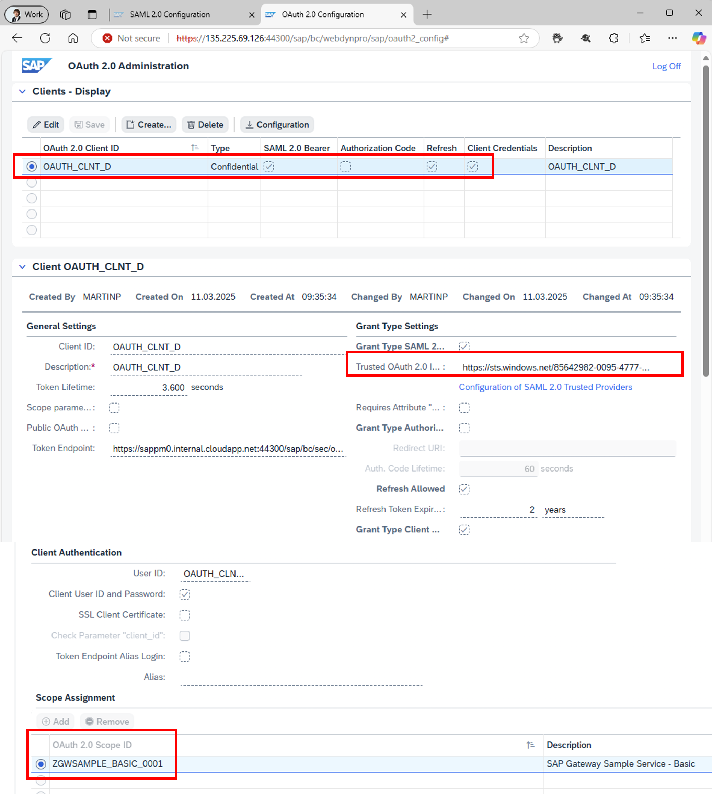
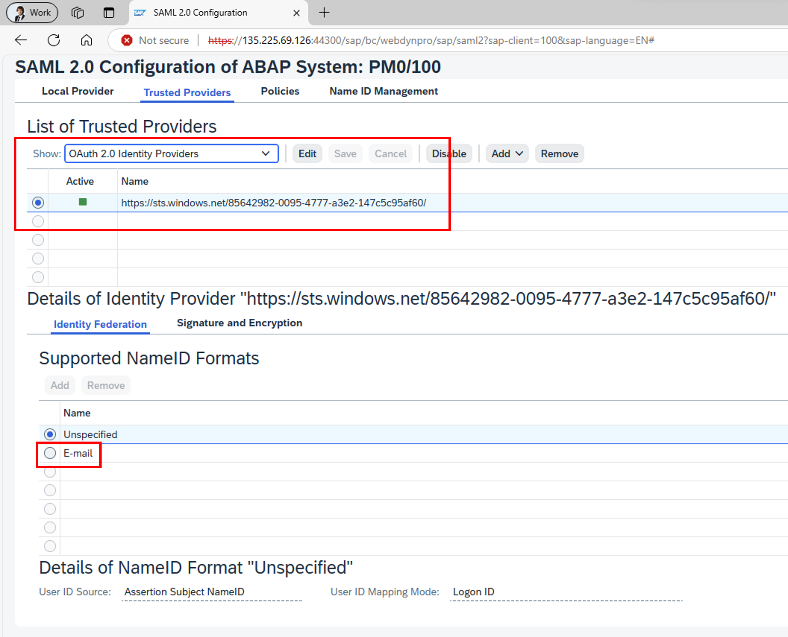
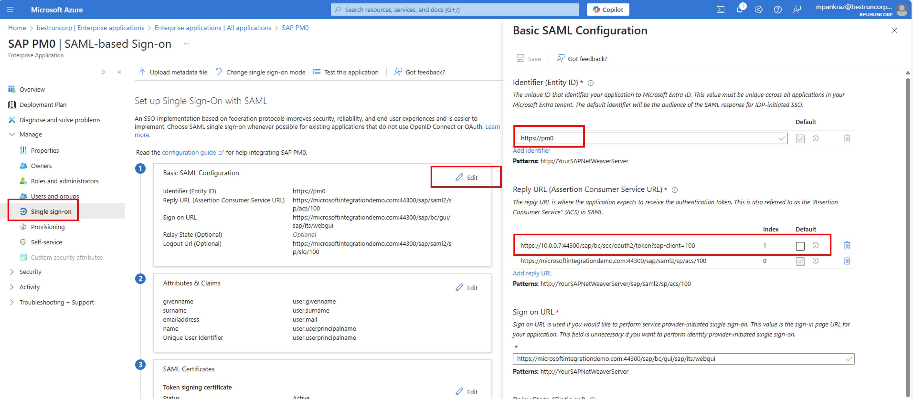
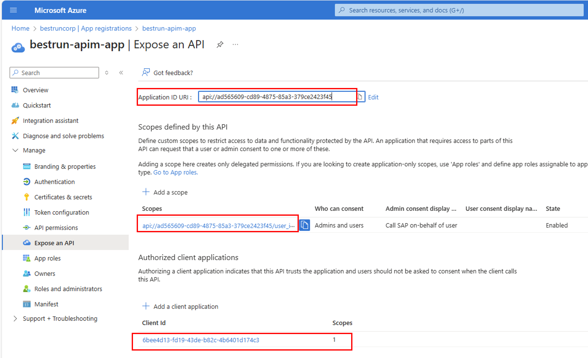
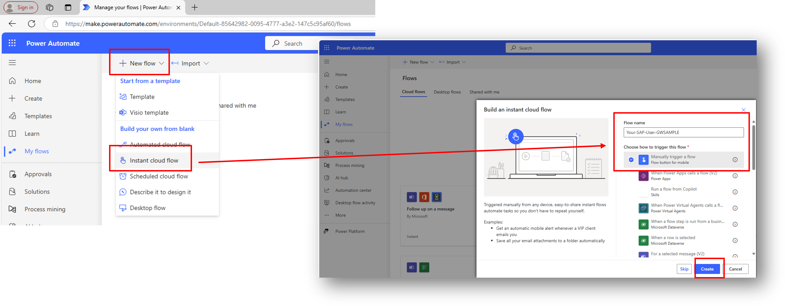
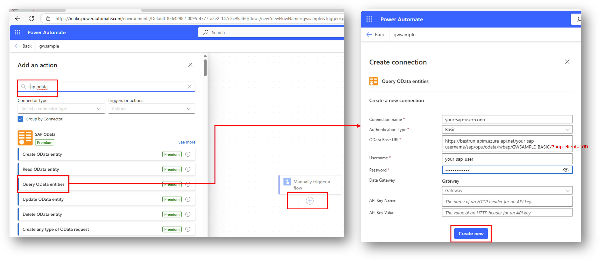
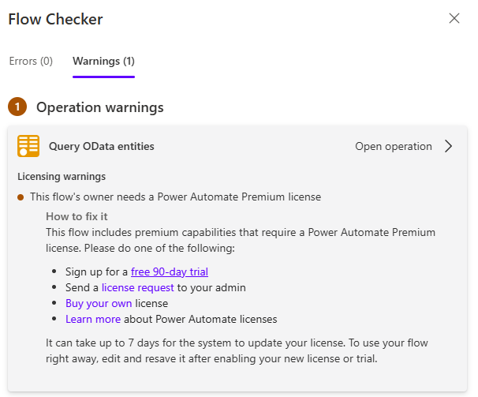

# Discover your integration target

**[🏠Home](../README.md)** - [ Quest 2 >](quest2.md)

## Step 1: Call the SAP OData API with Basic Authentication on AS ABAP

Navigate to the following SAP Gateway URL in your browser to see the metadata of the SAP OData API. You will be prompted for credentials. Use the provided credentials.

```bash
https://microsoftintegrationdemo.com:44300/sap/opu/odata/iwbep/GWSAMPLE_BASIC/?sap-client=100
```

See the entity `BusinessPartnerSet`

> [!NOTE]
> later on you will be calling the OData service from API Management, not directly on SAP Gateway. This is only possible in this setup, because the SAP system is exposed to the internet.

## Step 2: Understand the OAuth and SSO setup

### SAP OAuth Server

We prepared an OAuth client in the SAP system for you authorized for the OData service GWSAMPLE_BASIC with scope `ZGWSAMPLE_BASIC_0001`. 

<!-- TODO: Das ist nur zur Info, oder? Muss der Benutzer hier was tun? Sollten wir highlighten, worum es hier geht?-->



That client trusts our bestrun Entra ID tenant.

<!-- TODO: Braucht man hier eine Info,  was 'trust' bedeutet? -->



[video reference: minute 5:20](https://www.youtube.com/watch?v=AcM67FBIEB4&list=PLvqyDwoCkBXYHECuHw2pKN2DrWjyn3q5f&index=9&t=320s)

### Entra ID enterprise app registration (SAP NetWeaver)

This app hosts the SSO setup for the SAP system. It is configured to use the OAuth client created in the previous step.



### Entra ID app registration (API Management)

For segregation of concerns, we created a separate app registration for API Management to abstract away the complexity of calling SAP. This app is used to call the SAP OData API for any consumer apps authorized on APIM. In our case Microsoft Power Automate. It is configured to use the OAuth client created in the previous step.



### We take note of app id URI for later in Power Automate

```bash
api://ad565609-cd89-4875-85a3-379ce2423f45
```

[video reference: minute 8:50](https://www.youtube.com/watch?v=AcM67FBIEB4&list=PLvqyDwoCkBXYHECuHw2pKN2DrWjyn3q5f&index=9&t=530s)

## Step 3: Register the SAP OData API in Azure API Management

Navigate to the following URL in your browser to login to Azure Portal. Use the provided credentials.

```bash
https://portal.azure.com/?feature.customportal=false#@bestruncorp.onmicrosoft.com/resource/subscriptions/48b193a0-2500-45b5-ad41-f09cde1a95cd/resourceGroups/SAPEntra-RG/providers/Microsoft.ApiManagement/service/bestrun-apim/apim-apis
```

<!-- TODO: Note that users might register for MFA if they're asked for. -->

### Import the SAP OData API in Azure API Management

* Import the SAP OData API in Azure API Management. Either copy the metadata output from step 1 to your clipboard or load the content from the file in this [repo](assets/gwsamplebasic.edmx).

<!-- TODO: The content seems to be pretty differnt; I took the longer content from the GitHub repo. -->

* Supply the following values in the OData API create wizard on Azure API Management:

  * **Display name**: `your-sap-user-name`

  * **Name**: `your-sap-user-name`

  * **API URL suffix**: `your-sap-user-name/sap/opu/odata/iwbep/GWSAMPLE_BASIC`

[video reference: minute 2:00](https://www.youtube.com/watch?v=AcM67FBIEB4&list=PLvqyDwoCkBXYHECuHw2pKN2DrWjyn3q5f&index=9&t=120s)

* Click Create.

* Click on the API you just created and navigate to the **Settings** tab.

* Verify the following settings:

  * **URL scheme**: `HTTPS`

    (Make sure to pick `HTTPS` instead of `HTTP(S)`.)

  * **Web Service URL**: `https://microsoftintegrationdemo.com:44300/sap/opu/odata/iwbep/GWSAMPLE_BASIC`

  * **Base URL (take note of this for later)**: `https://bestrun-apim.azure-api.net/your-sap-username/sap/opu/odata/iwbep/GWSAMPLE_BASIC`

  * **Subscription required**: `unchecked`

    (Make sure to uncheck!)

> [!NOTE]
> SAP OData APIs can be registered via their OData or OpenAPI definition. The required conversion from OData to OpenAPI can be done from converters like [this](https://convert.odata-openapi.net/). The underlying foundation is maintained by the Oasis foundation, which leads the standardization of OData. The OData to OpenAPI converter is open source and available on [GitHub](https://github.com/MartinPankraz/odata-openapi)

### Call your new SAP OData API registered on Azure API Management using Basic Authentication

* Open a new browser tab and navigate to the following URL: `https://bestrun-apim.azure-api.net/your-sap-username/sap/opu/odata/iwbep/GWSAMPLE_BASIC/BusinessPartnerSet?sap-client=100&$top=10`
* Use the provided SAP credentials to authenticate.

### Call your new SAP OData API using Microsoft Power Automate

* Navigate to the following URL in your browser to login to Power Automate. If prompted, use the provided Entra ID credentials.

```bash
https://make.powerautomate.com/environments/Default-85642982-0095-4777-a3e2-147c5c95af60/home
```

* Create a new flow, use `[your-sap-user-name]-sample` (e.g., `user001-sample`) as name and select the **Manually trigger a flow** trigger.



> [!NOTE] 
> We are taking this shortcut and avoid creating a full UI in Power Apps to focus on the Principal Propagation aspect given the short hands-on session duration.

* Add a new action, search for **SAP OData**, fill the details, and provide your credentials.

  (Make sure to append query parameter `?sap-client=100` to the Base URL you copied from the API definition in Azure API management.)



* Click `Create`.

* In the drop-down list `OData Entity name` on the next page, select `BusinessPartnerSet`.

* From the `Advanced parameters` drop down, check the `$top` parameter and specify value `10`.


* Save your flow by clicking the `Save` button on the right side of the menu bar.

* In case a warning message pops up, notifying you about a missing Power Automate Premium license, click `Sign up for a free 90-day trial` and confirm by clicking `Start trial` on the following pop-up.



* Then click `Test` in the menu bar, pick `Manually` and then kick off the test process with another click on `Test` on the bottom of the page. Confirm the test execution with clicks on `Continue` and `Run flow`. 

* Open the 'Flow Runs Page' to confirm your test has completed successfully.


Ok, all access prepared. You are all set up to do some principal propagation!

## Where to next?

**[🏠Home](../README.md)** - [ Quest 2 >](quest2.md)

[🔝](#)