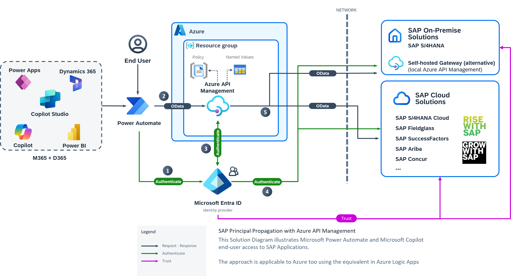
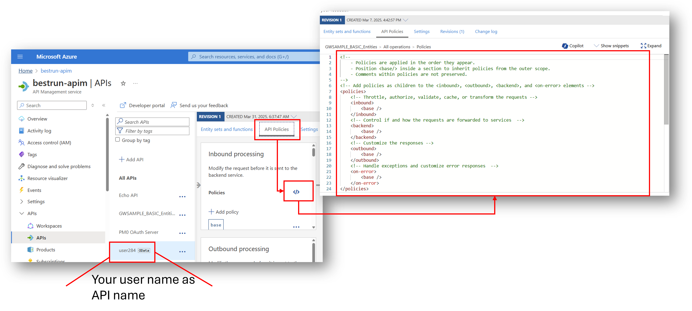

# Configure your API Management instance

[< Quest 1 ](quest1.md) - **[🏠Home](../README.md)** - [ Quest 3 >](quest3.md)

In this quest, you will uplevel your setup from Basic Authentication to OAuth 2.0 for SAP Principal Propagation. The "token dance" is performed by the official Azure API Management policy.

Consider especially the center of the image depicting the assets **policy** and **named values** being used on Azure API Management to enable SAP Principal Propagation.

> [!NOTE]
> In case your wonder about SAP API Management, find the same policy published officially on the [SAP Business Accelerator Hub](https://api.sap.com/policytemplate/Principal_Propagation_via_Entra_Id). We co-authored them with SAP and released the [joint blog here](https://community.sap.com/t5/enterprise-resource-planning-blogs-by-members/integrating-low-code-solutions-with-microsoft-using-sap-integration-suite/ba-p/13789298).

## Import the SAP Principal Propagation policy

* Find the policy from the [official GitHub repository](https://github.com/Azure/api-management-policy-snippets/blob/master/examples/Request%20OAuth2%20access%20token%20from%20SAP%20using%20AAD%20JWT%20token.xml)
* See lines 11 - 19. These are the values that need to be provided as Azure API Management named values for the "token dance". They have been presented to you in quest1.
* Copy the policy from the [official GitHub repository](https://github.com/Azure/api-management-policy-snippets/blob/master/examples/Request%20OAuth2%20access%20token%20from%20SAP%20using%20AAD%20JWT%20token.xml)
* Import the policy into your API Management instance. You can do this by navigating to the **API Policies** section of your OData API, selecting the code icon `</>` under **Inbound Processing** and paste the policy into the XML editor. Make sure to override the whole default XML.

* Click Save.

Now your SAP OData API only accepts OAuth 2.0 tokens issued by the SAP OAuth server. The policy will take care of the token dance and will exchange the Entra ID token for an SAP OAuth token. Best of all: token caching is built-in, so SAP OAuth tokens are only requested when they are expired. This is a great performance improvement.

## Supply the named values

* Navigate to the **Named Values** section of your API Management instance and create the following named values always prefixed with `your-sap-username_`

| Named Value                        | Description          |
|------------------------------------|----------------------|
| your-sap-username_SAPOAuthScope    | ZGWSAMPLE_BASIC_0001 |

Remaining ones are shared and have been pre-provided on the Azure APIM instance already.

| Named Value                        |
|------------------------------------|
| AADTenantId                        |
| APIMAADRegisteredAppClientId           |
| APIMAADRegisteredAppClientSecret       |
| AADSAPResource                     |
| SAPOAuthClientID                   |
| SAPOAuthClientSecret               |
| SAPOAuthServerAdressForTokenEndpoint |
| SAPOAuthRefreshExpiry              |

## Adjust the policy for your named value

* Navigate to the **API Policies** section of your OData API, selecting the code icon `</>` under **Inbound Processing** and adjust the policy to use your oauth scope variable. [Search](https://github.com/Azure/api-management-policy-snippets/blob/master/examples/Request%20OAuth2%20access%20token%20from%20SAP%20using%20AAD%20JWT%20token.xml#L50) for `{{SAPOAuthScope}}` variable assignment (hint: line 50) and replace it with your individual value `{{your-sap-username_SAPOAuthScope}}`. That's it. Don't touch the local variable names!

## Where to next?

[< Quest 1 ](quest1.md) - **[🏠Home](../README.md)** - [ Quest 3 >](quest3.md)

[🔝](#)