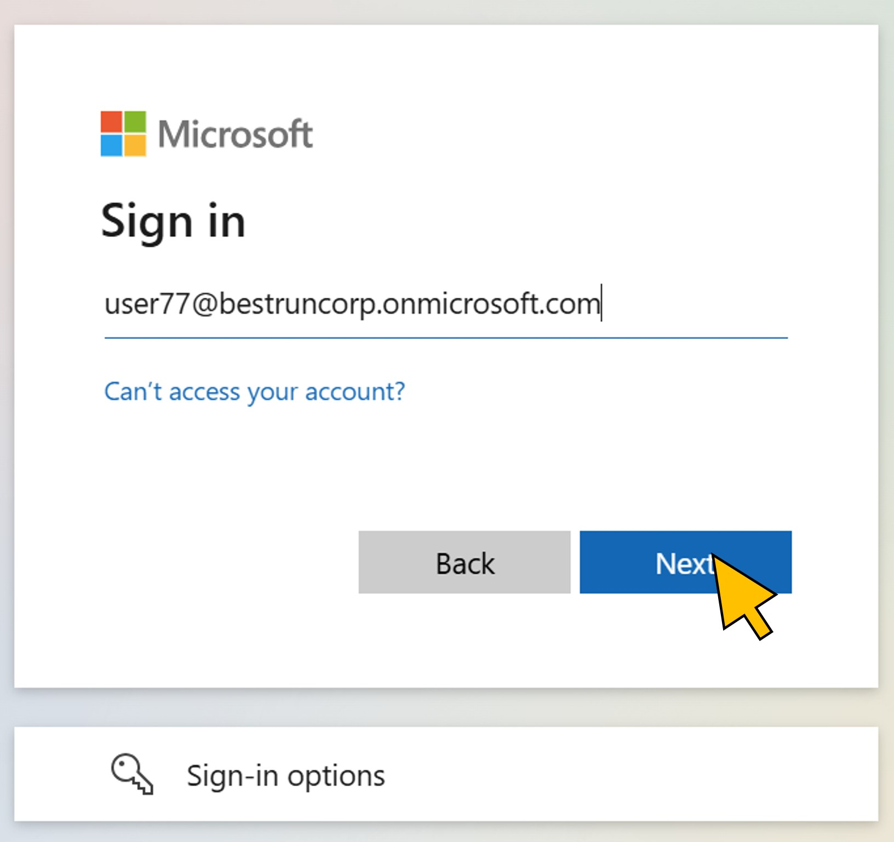
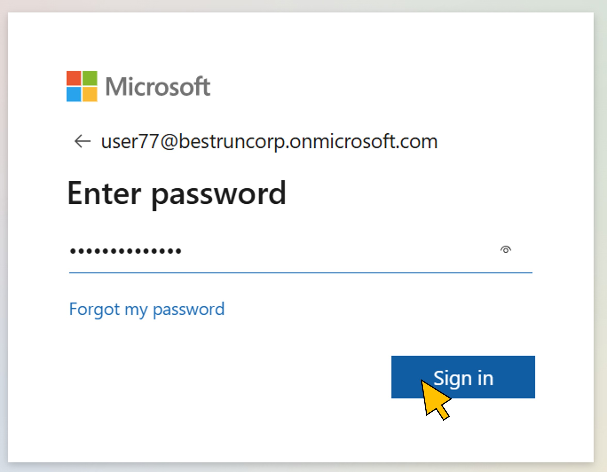
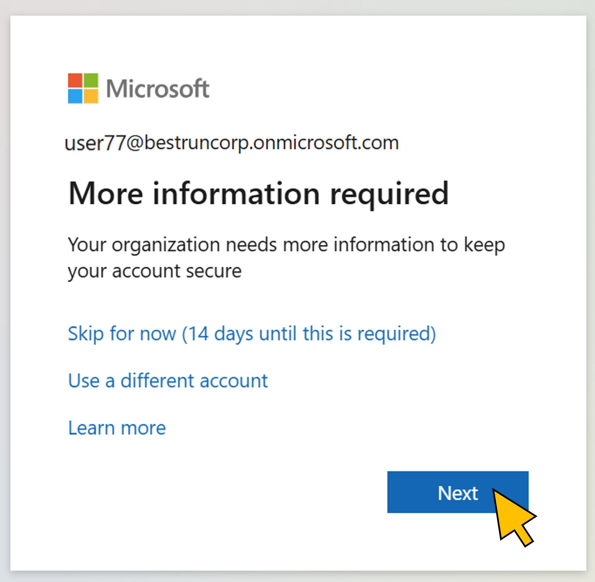
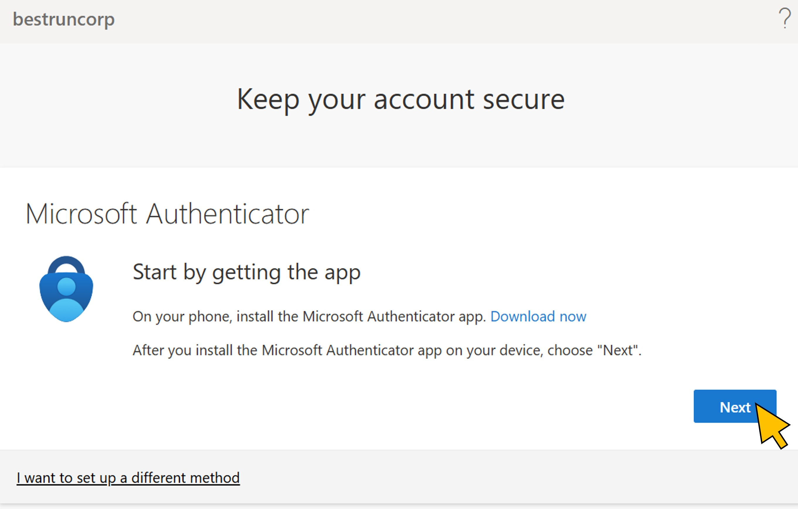
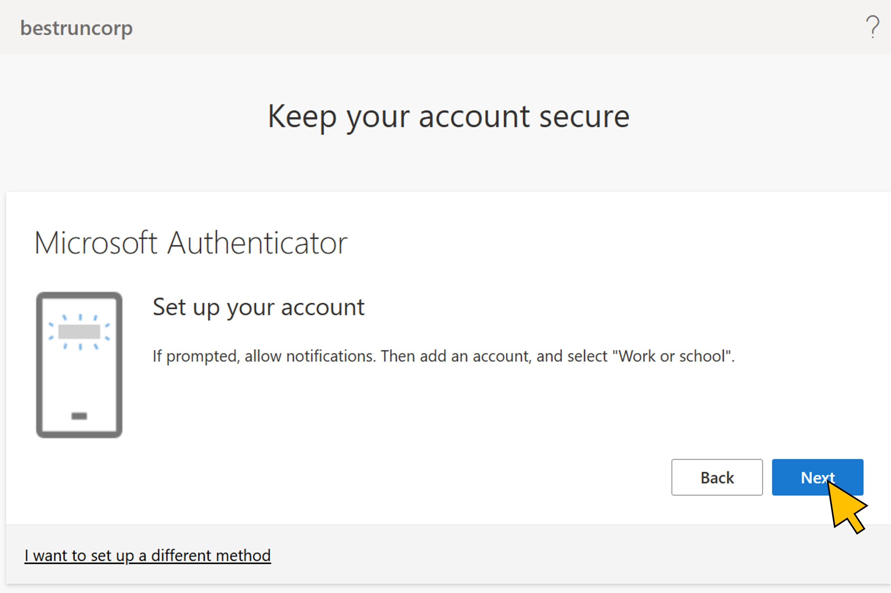
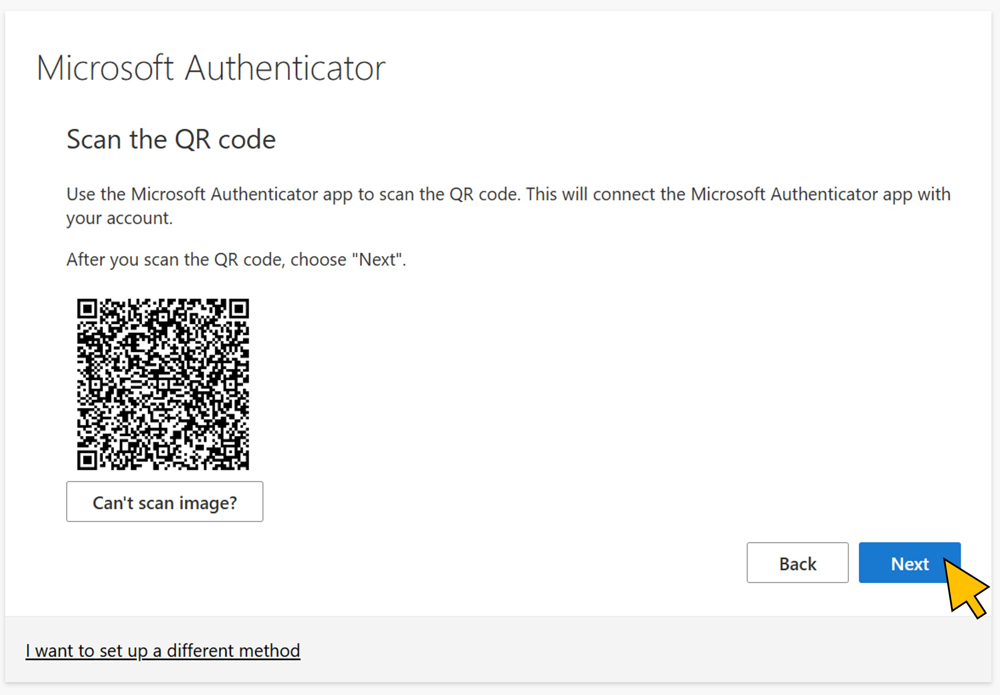
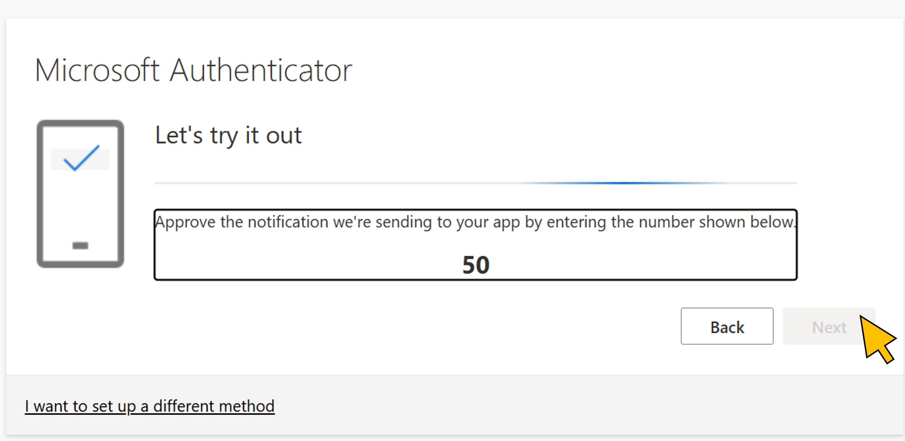

# Exercise 1: Testing access to SAP BTP before requesting the access package
In this first exercise you login with your student's user account to SAP Business Application Studio. As expeczed, access will be denied because your user is not yet assigned to the *SAP BTP Developer* group in Entra.

| Step   | Description                | Screenshot |
| :----- | :------------------------- | :--------- |
| 1.1    |Lorem Ipsum      ||
| 1.2    |Lorem Ipsum      ||
| 1.3    |Lorem Ipsum      ||
| 1.4    |Lorem Ipsum      ||
| 1.5    |Lorem Ipsum      ||
| 1.6    |Lorem Ipsum      ||
| 1.7    |Lorem Ipsum      ||
| 1.8    |Lorem Ipsum      ||

Continue with [exercise 2](../ex2/ex2.md).