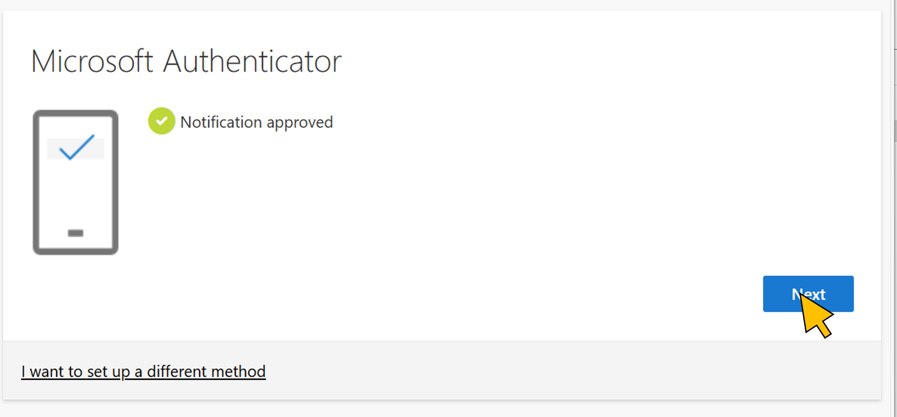

# Exercise 1: Setup MFA for your user and test access to SAP BTP
In this first exercise you setup MFA for your developer user and try to login to SAP Business Application Studio. As expected, access will be denied because your user is not yet assigned to the *SAP BTP Developer* group in Entra.

**Duration: 5 minutes.**

| Step   | Description                | Screenshot |
| :----- | :------------------------- | :--------- |
| 1.1    |Start a new web browser window and open **SAP Business Application Studio** at ```https://4478e7a5trial.ap21cf.trial.applicationstudio.cloud.sap/```.<br><br>SAP IAS proxies the login request to Microsoft Entra, where you login with user\<41..80\>@bestruncorp.onmicrosoft.com.      |<a href="./img/1-1.jpg" target="_blank"></a>|
| 1.2    |Enter the password and click **Sign-in**.|<a href="./img/1-2.jpg" target="_blank"></a>|
| 1.3    |Click **Next**.|<a href="./img/1-3.jpg" target="_blank"></a>|
| 1.4    |Click **Next**.|<a href="./img/1-4.jpg" target="_blank"></a>|
| 1.5    |Click **Next**.|<a href="./img/1-5.jpg" target="_blank"></a>|
| 1.6    |Launch the Microsoft Authenticator app on your mobile device. Add a new account with \"**+**\".<br><br>Choose **School- or Workaccount**. Select **Scan QR-Code** and scan the QR code with the device camera.<br><br>Click **Next**.|<a href="./img/1-6.jpg" target="_blank"></a>|
| 1.7    |Enter the number shown on the screen in the Authenticator app.<br><br>Click **Next**.|<a href="./img/1-7.jpg" target="_blank"></a>|
| 1.8    |Click **Next**.|<a href="./img/1-8.jpg" target="_blank"></a>|
| 1.9    |Click **Done**.|<a href="./img/1-9.jpg" target="_blank"></a>|
| 1.10    |Click **Yes**.|<a href="./img/1-10.jpg" target="_blank"></a>|
| 1.11    |Provide your user consent to allow SAP IAS tenant to request your basic user profile data by clicking **Accept**.|<a href="./img/1-11.jpg" target="_blank"></a>|
| 1.12    |Activate the checkbox on the welcome screen of *SAP Business Application Studio* and click **OK**.|<a href="./img/1-12.jpg" target="_blank"></a>|
| 1.13    |Because your user is not assigned to the required group in Microsoft Entra, SAP Business Application Studio cannot find any of the required roles and denies access.<br><br>Click **Logout**|<a href="./img/1-13.jpg" target="_blank"></a>|

Continue with [exercise 2](../ex2/ex2.md), or go back to the [overview](../README.md).
