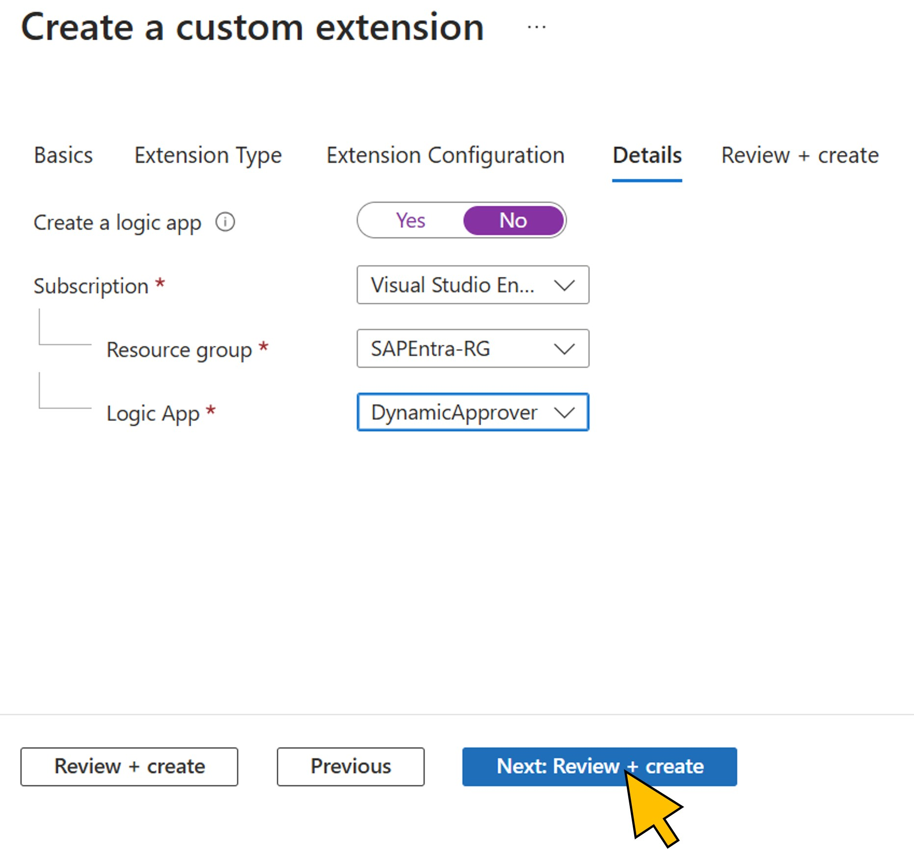

# Exercise 2: Create the access package for SAP BTP Developers in Entra ID Governance
To request assignment to the *SAP BTP Developer* group, an access package is created in this exercise. You will use the Microsoft Entra admin center for this task.
The steps in this exercise will only create the basic setup. In the next [exercise](../ex3/ex3.md), you will use the Microsoft Graph API to configure further settings on the access package, such as the approval workflow for the scenario. 

| Step   | Description     | Screenshot          |
| :----- | :-------------- | :-----------------: |
| 2.1    |Lorem Ipsum      ||
| 2.2    |Lorem Ipsum      ||
| 2.3    |Lorem Ipsum      ||
| 2.4    |Lorem Ipsum      ||
| 2.5    |Lorem Ipsum      ||
| 2.6    |Lorem Ipsum      ||
| 2.7    |Lorem Ipsum      ||
| 2.8    |Lorem Ipsum      ||
| 2.9    |Lorem Ipsum      ||
| 2.10   |Lorem Ipsum      ||
| 2.11   |Lorem Ipsum      ||
| 2.12   |Lorem Ipsum      ||
| 2.13   |Lorem Ipsum      ||
| 2.14   |Lorem Ipsum      ||
| 2.15   |Lorem Ipsum      ||
| 2.16   |Lorem Ipsum      ||
| 2.17   |Lorem Ipsum      ||
| 2.18   |Lorem Ipsum      ||
| 2.19   |Lorem Ipsum      ||
| 2.20   |Lorem Ipsum      ||
| 2.21   |Lorem Ipsum      ||
| 2.22   |Lorem Ipsum      ||
| 2.23   |Lorem Ipsum      ||
| 2.24   |Lorem Ipsum      ||
| 2.25   |Lorem Ipsum      ||
| 2.26   |Lorem Ipsum      ||

Continue with [exercise 3](../ex3/ex3.md), or go back to the [overview](../README.md).