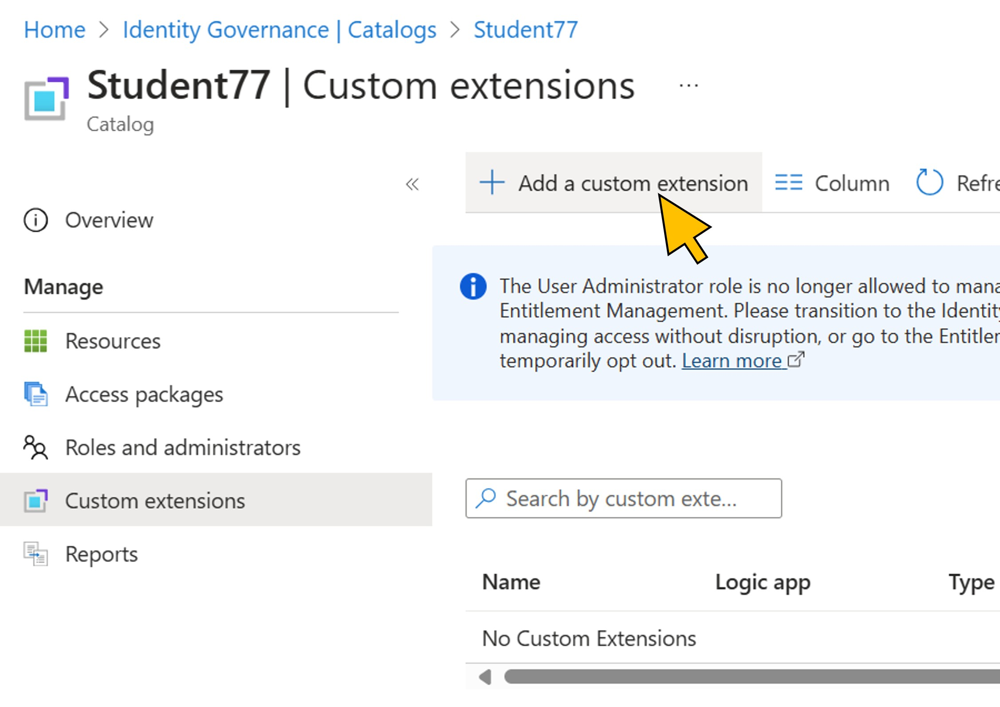

# Exercise 2: Register the custom extension for dynamic approval
To request assignment to the *SAP BTP Developer* group, an access package is created that uses an existing logic app to find the approver based on the request context. You will use the Microsoft Entra admin center with a preview feature flag enabled for *dynamic approval* to configure the access package, starting with the registration of the logic app as a custom extension in your catalog. 

**Duration:** 5 minutes.

| Step   | Description     | Screenshot          |
| :----- | :-------------- | :-----------------: |
| 2.1    |Use the existing browser window to sign-in to [Microsoft Entra admin center](https://aka.ms/EMApprovalExtensibility) (use the link [https://aka.ms/EMApprovalExtensibility](https://aka.ms/EMApprovalExtensibility)!) with your user user\<41..70\>@bestruncorp.onmicrosoft.com. ||
| 2.2    |You are prompted for MFA to login to the Entra Admin Center.||
| 2.3    |Enter the number in your Microsoft Authenticator.||
| 2.4    |Select **Catalogs** from the navigation menu. In the search bar, enter your *Student*-number. Select the catalog **Student\<41..80\>** with the number assigned to you from the list.||
| 2.5    |Select **Custom extensions** from the navigation menu.  Click **+ Add a custom extension**.||
| 2.6    |On the first page **Basics** of the wizard, provide a name (*DynamicApprover*) and description.  Click **Next: Extension Type**.||
| 2.7    |Keep the default selection and click **Next: Extension Configuration**.||
| 2.8   |Select **Launch and wait** for the *Behaviour* of the new extension, and **Approval Stage (Preview)** for the *Response data*. Keep the expiration to 5 minutes.  Click **Next: Details**.||
| 2.9   |Select **No** for the switch to *Create a logic app*. You will use an existing logic app already deployed to the Entra tenant as follows:  **Subscription**: *Visual Studio Enterprise Abonnement*  **Resource Group**: *SAPEntra-RG*  **Logic App**: *DynamicApprover*  Click **Next:Review + create**.||
| 2.10   |Click **Create**.||
| 2.11   |Go to **Roles and administrators**.  Click **+ Add access package assignment manager**.||
| 2.12   |In the search bar, enter *DynamicApprover**. Switch to the **Enterprise applications** tab and activate the checkbox for the DynamicApprover enterprise app in the search results.  Click **Select**.||

Continue with [exercise 3](../ex3/ex3.md), or go back to the [overview](../README.md).
