# Exercise 3: Configure the access package assignment policy with the Microsoft Graph API
With the base access package created in the [previous exercise](../ex2/ex2.md), you will now add an assignment policy. The policy controls who can request the package and who can approve it. Since the feature for dynamic resolution of the approver with an Azure Logic App extension is still in a preview phase, you will use the Microsoft Graph Explorer to interact with the RESTful Graph API for this new feature. Once the feature is GA (general available), configuration via the Microsoft Entra Admin Center will also be possible. 

| Step   | Description     | Screenshot          |
| :----- | :-------------- | :-----------------: |
| 3.1    |Open a **new browser tab**.<br><br>Go to [Microsoft Graph Explorer](https://developer.microsoft.com/en-us/graph/graph-explorer).|<a href="./img/3-1.jpg" target="_blank"></a>|
| 3.2    |Login with your user account.|<a href="./img/3-2.jpg" target="_blank"></a>|
| 3.3    |Select **Next**|<a href="./img/3-3.jpg" target="_blank">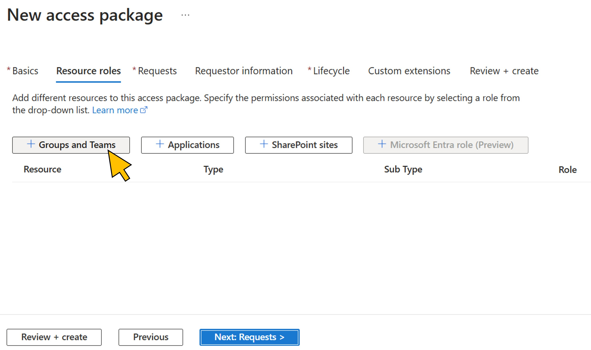</a>|
| 3.4    |Select **Done**|<a href="./img/3-4.jpg" target="_blank">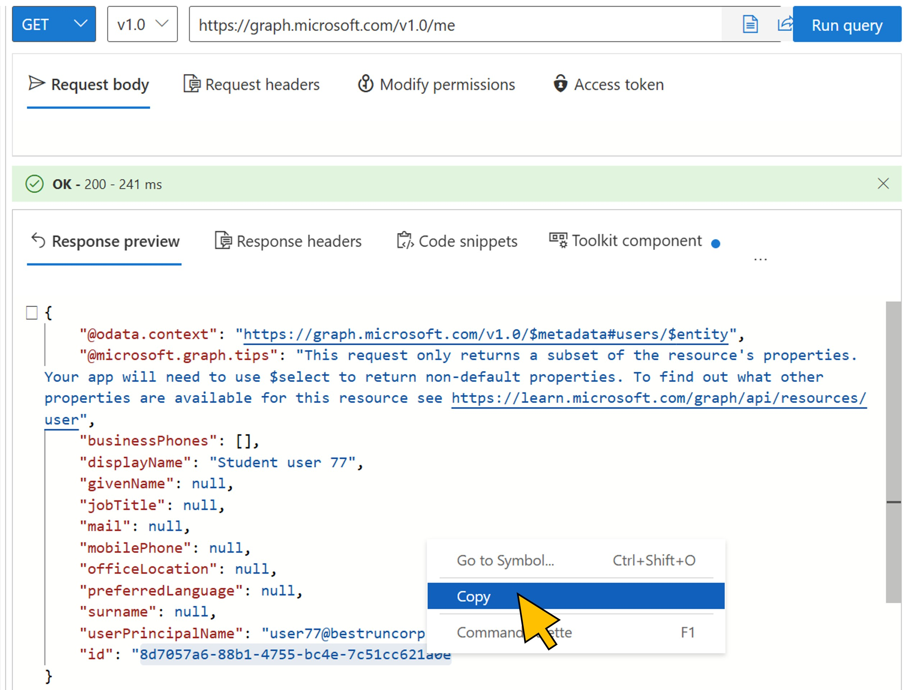</a>|
| 3.5    |Retrieve your user's data by clicking **Run query** for the Graph URL https://graph.microsoft.com/v1.0/me.|<a href="./img/3-5.jpg" target="_blank">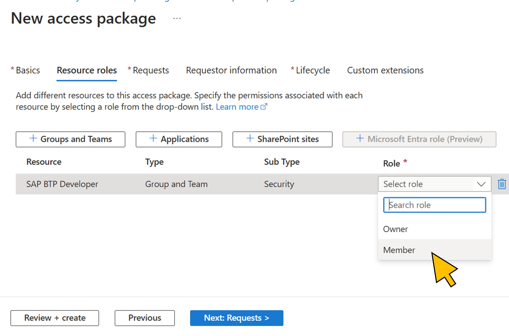</a>|
| 3.6    |In the **Response preview** tab, mark the value for the *id* element, **right-click**, and select **Copy** from the context menu.|<a href="./img/3-6.jpg" target="_blank">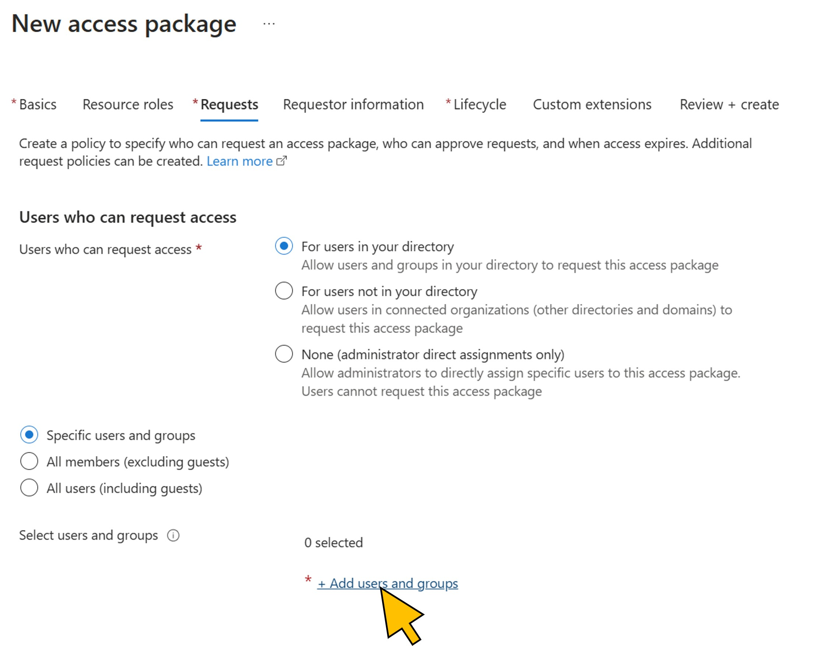</a>|
| 3.7    |Paste the user id value from the clipboard to your text file, and add a lable to it, e.g. *User ID*.|<a href="./img/3-7.jpg" target="_blank">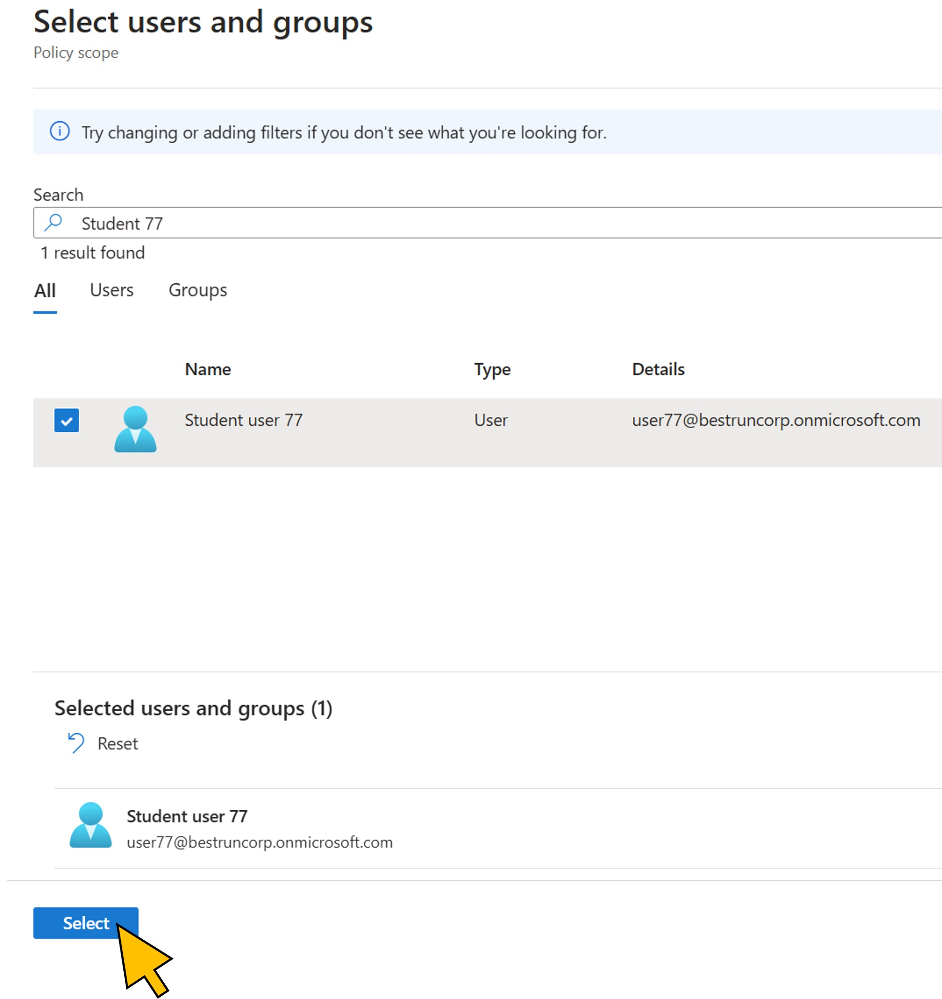</a>|
| 3.8    |Copy and paste the following URL into Graph Explorer:<br><br>```https://graph.microsoft.com/beta/identityGovernance/entitlementManagement/accessPackageCatalogs/<catalog id>/accessPackageCustomWorkflowExtensions```<br><br>Replace the \<catalog_id\> with the value from your text file.|<a href="./img/3-8.jpg" target="_blank">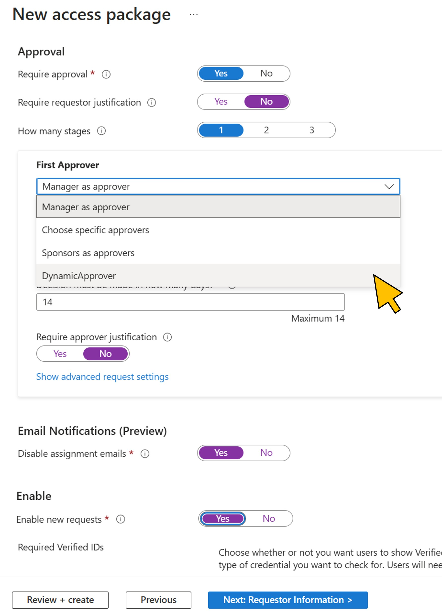</a>|
| 3.9    |Lorem Ipsum      |<a href="./img/3-9.jpg" target="_blank">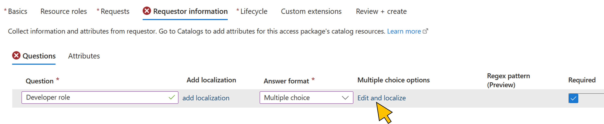</a>|
| 3.10   |Lorem Ipsum      |<a href="./img/3-10.jpg" target="_blank">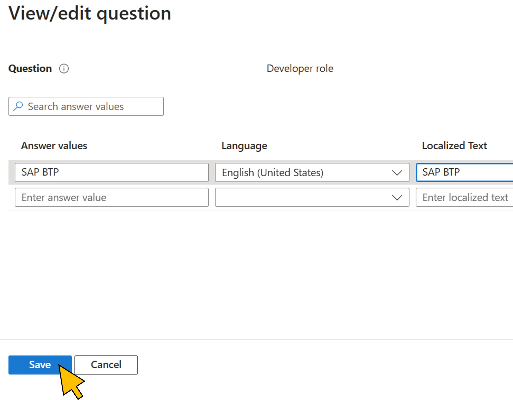</a>|
| 3.11   |Lorem Ipsum      |<a href="./img/3-11.jpg" target="_blank">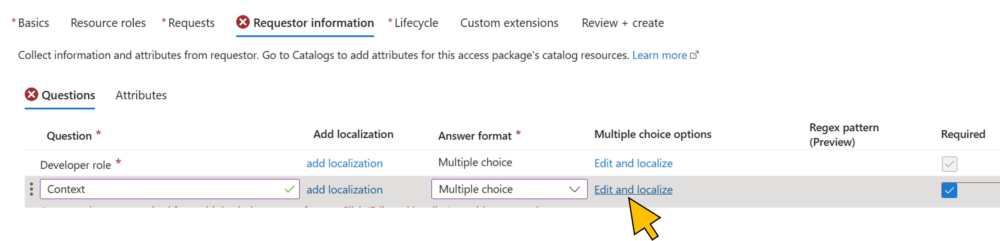</a>|
| 3.12   |Lorem Ipsum      |<a href="./img/3-12.jpg" target="_blank">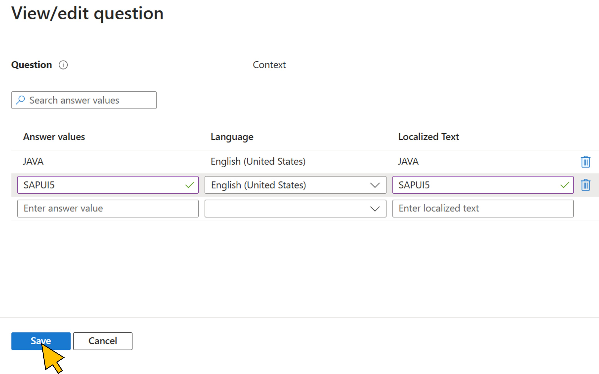</a>|
| 3.13   |Lorem Ipsum      |<a href="./img/3-13.jpg" target="_blank">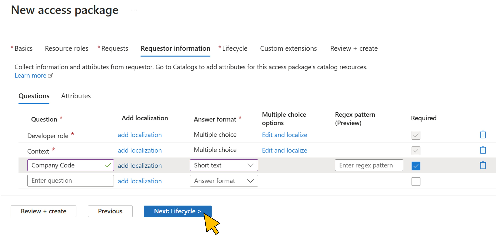</a>|
| 3.14   |Lorem Ipsum      |<a href="./img/3-14.jpg" target="_blank">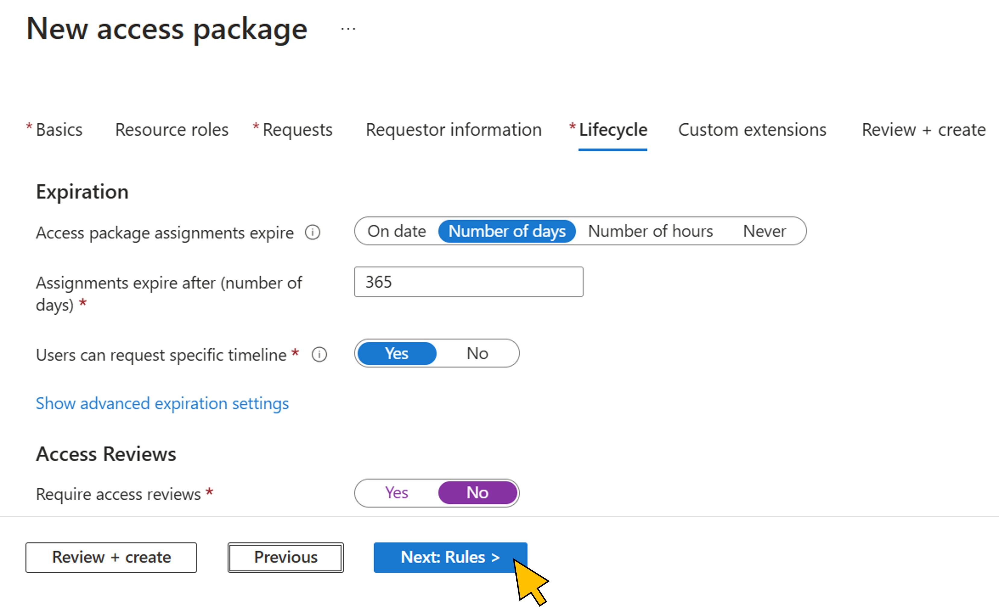</a>|
| 3.15   |Lorem Ipsum      |<a href="./img/3-15.jpg" target="_blank">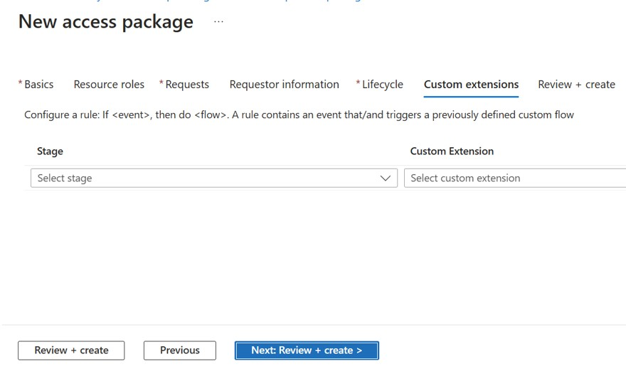</a>|
| 3.16   |Lorem Ipsum      |<a href="./img/3-16.jpg" target="_blank">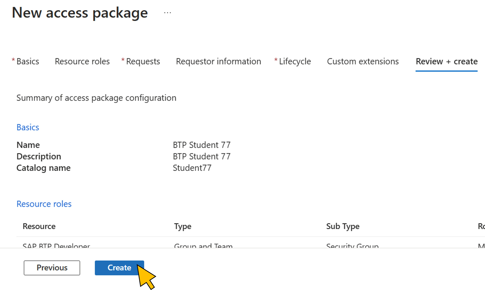</a>|
| 3.17   |Lorem Ipsum      |<a href="./img/3-17.jpg" target="_blank"></a>|
| 3.18   |Lorem Ipsum      |<a href="./img/3-18.jpg" target="_blank">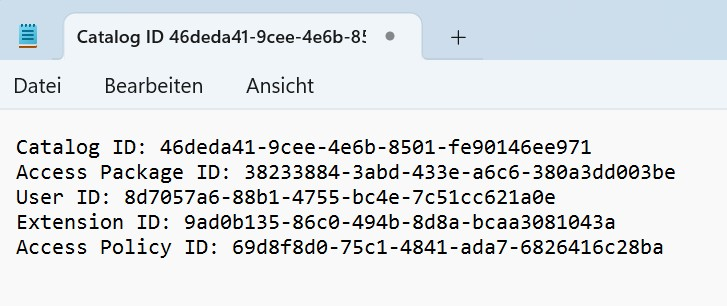</a>|
| 3.19   |Lorem Ipsum      |<a href="./img/3-19.jpg" target="_blank">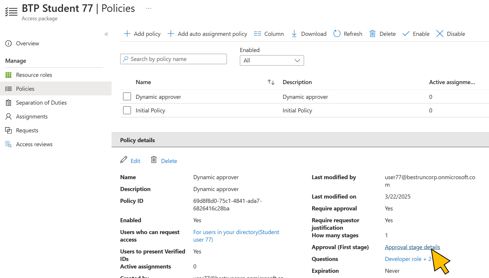</a>|
| 3.20   |Lorem Ipsum      |<a href="./img/3-20.jpg" target="_blank"></a>|

Continue with [exercise 4](../ex4/ex4.md), or go back to the [overview](../README.md).
