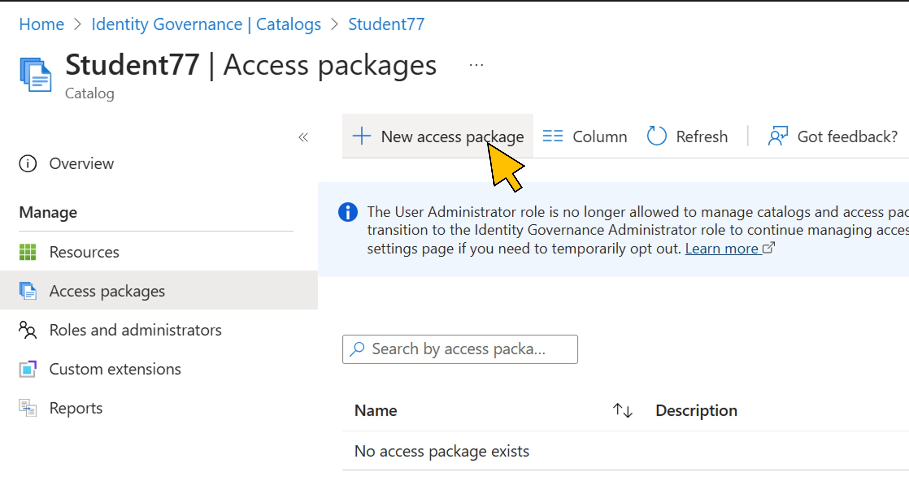
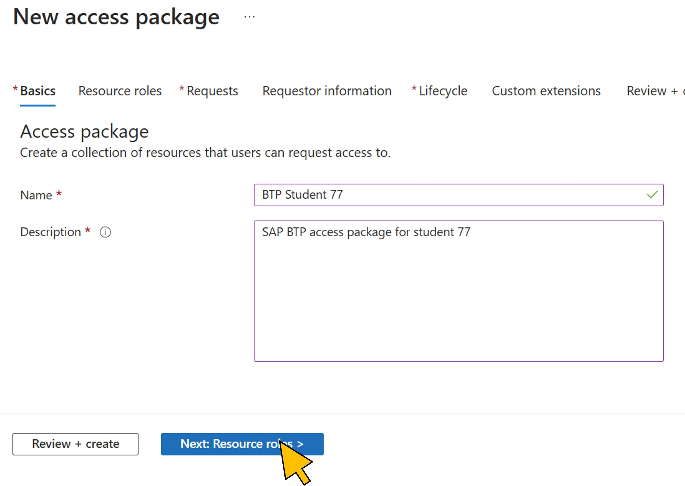
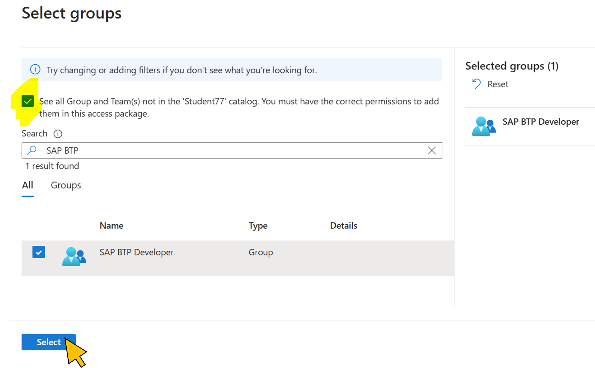
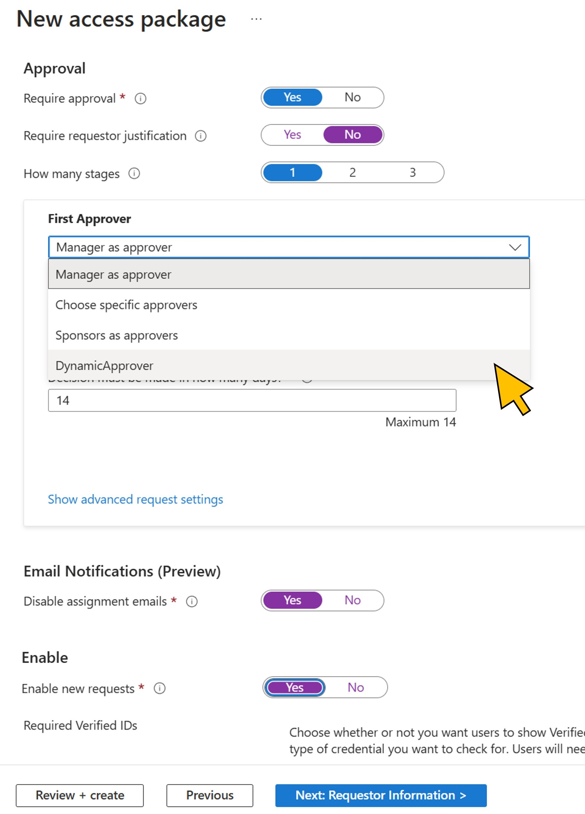

# Exercise 3: Create the access package and configure the assignment policy
With the custom extension registered in your catalog, you are now ready to create the access package and the assignment policy that uses the custom extension. An assignment policy controls who can request the access package and who can approve it. In this scenario, the approver will be dynamically determined by the results returned from the custom extension. 

**Duration:** 10 minutes

| Step   | Description     | Screenshot          |
| :----- | :-------------- | :-----------------: |
| 3.1    |Navigate to **Access packages**.  Click **+ New access package**.||
| 3.2    |On the first page of the wizard, provide a **Name** for the new access package, e.g. *BTP Student \<41..70\>.  Enter a description and click **Next: Resource roles**.||
| 3.3    |Under **Resource roles**, click **+ Groups and Teams**.||
| 3.4    |Activate the **checkbox** to *see all groups*. Enter *SAP BTP* in the search field.  Activate the **checkbox** for the *SAP BTP Developer* group.  Click **Select**.||
| 3.5    |From the **Role** drop-down list, select *Member*.  Click **Next: Requests**||
| 3.6   |Select **For users in your directory** and **Specific users and groups** for *Users who can request access*.  Click **+ Add users and groups**.||
| 3.7   |Enter *Student \<NN\>* in the search bar.  Activate the checkbox on your user in the result list  Click **Select**.||
| 3.8   |Switch **Require requestor justification** to *No*.  From the **First approver** drop-down list, select the *DynamicApprover* custom extension.  Switch **Require approver justification** to *No*.  Switch **Disable assignment emails** to *Yes*.  Switch **Enable new request** to *Yes*.  Click **Next: Requestor information**.||
| 3.9   |Under **Questions**, enter *Developer role* for the first *Question*.  Select *Multiple choice* for the **Answer format**.  Activate the **Required** checkbox.  Click **Edit and localize**.||
| 3.10   |Enter *SAP BTP* for the **Answer value**.  Select *English (United States)* as **Language**, and enter *SAP BTP* for the **Localized text**.  Click **Save**.||
| 3.11   |Add the next **Question** and enter *Context*.  Select *Multiple choice* for the **Answer format**.  Activate the **Required** checkbox.  Click **Edit and localize**.||
| 3.12   |Add the answer *JAVA* (**Answer value**), *English (United States) (**Language**), and *JAVA* (**Localzed text**).  Add a second answer *SAPUI5* (**Answer value**), *English (United States) (**Language**), and *SAPUI5* (**Localzed text**).  Click **Save**.||
| 3.13    |Finally, add the third **Question** *Company code*, **Answer format** *Short text*. Activate **Required**.  Click **Next: Lifecycle**.||
| 3.14    |Keep all defaults, but switch **Require access reviews** to *No*.  Click **Next: Rules**.||
| 3.15    |Click **Next: Review + create**.||
| 3.16    |Click **Create**.||

Continue with [exercise 4](../ex4/ex4.md), or go back to the [overview](../README.md).
