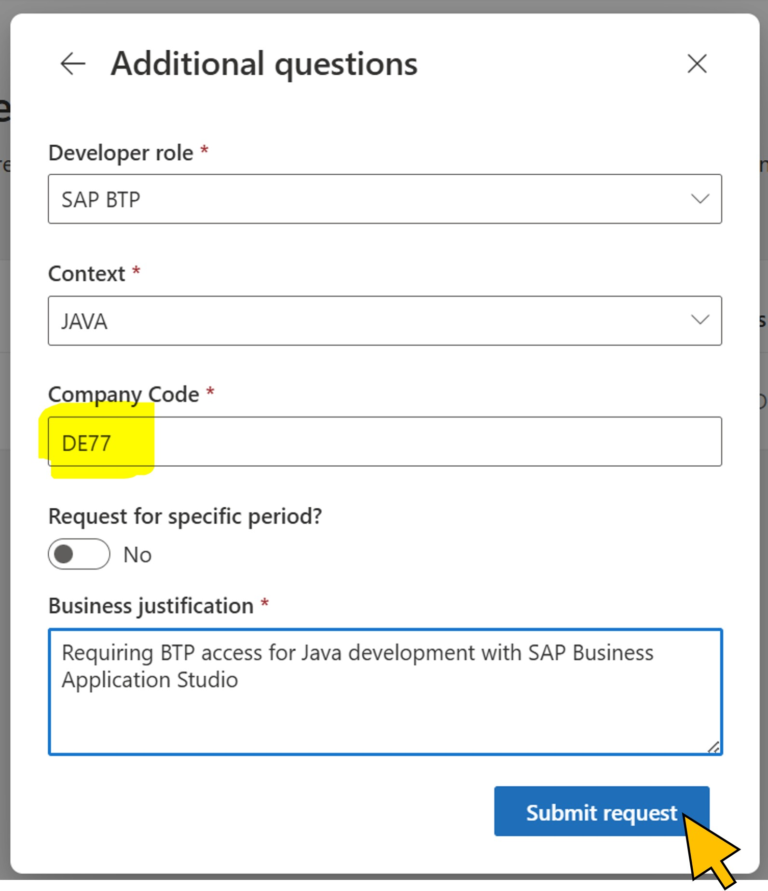
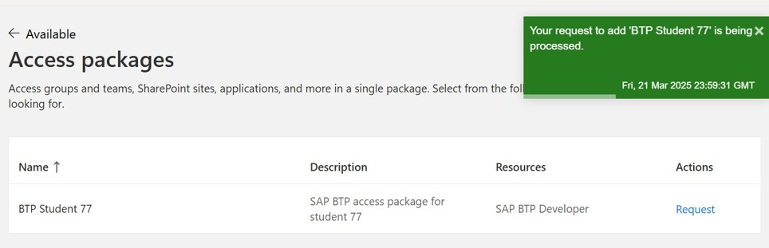

# Exercise 4: Test the new dynamic approval workflow
You are now ready to test the approval workflow by initiating a new request for the access package. You will also verify the execution of the *DynamicApprover* Logic App and the response from
the IAM OData service in S/4 HANA by using the available monitoring and troubleshooting tools.  

| Step   | Description     | Screenshot          |
| :----- | :-------------- | :-----------------: |
| 4.1    |Lorem Ipsum      ||
| 4.2    |Lorem Ipsum      ||
| 4.3    |Lorem Ipsum      ||
| 4.4    |Lorem Ipsum      ||
| 4.5    |Lorem Ipsum      ||
| 4.6    |Lorem Ipsum      ||
| 4.7    |Lorem Ipsum      ||
| 4.8    |Lorem Ipsum      ||
| 4.9    |Lorem Ipsum      ||
| 4.10   |Lorem Ipsum      ||
| 4.11   |Lorem Ipsum      ||
| 4.12   |Lorem Ipsum      ||
| 4.13   |Lorem Ipsum      ||
| 4.14   |Lorem Ipsum      ||
| 4.15   |Lorem Ipsum      ||

Continue with [exercise 5](../ex5/ex5.md).