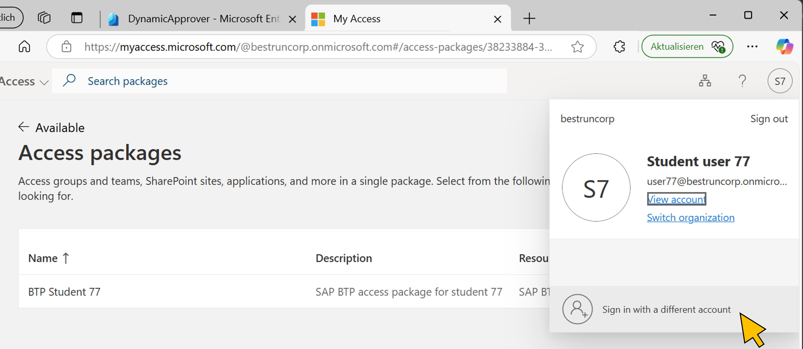

# Exercise 5: Approve the access package request
Continue testing the scenario by logging in to the *MyAccess* portal as the approver who was returned by the OData service.

| Step   | Description     | Screenshot          |
| :----- | :-------------- | :-----------------: |
| 5.1    |Lorem Ipsum      ||
| 5.2    |Lorem Ipsum      ||
| 5.3    |Lorem Ipsum      ||
| 5.4    |Lorem Ipsum      ||
| 5.5    |Lorem Ipsum      ||
| 5.6    |Lorem Ipsum      ||
| 5.7    |Lorem Ipsum      ||

Continue with [exercise 6](../ex6/ex6.md), or go back to the [overview](../README.md).