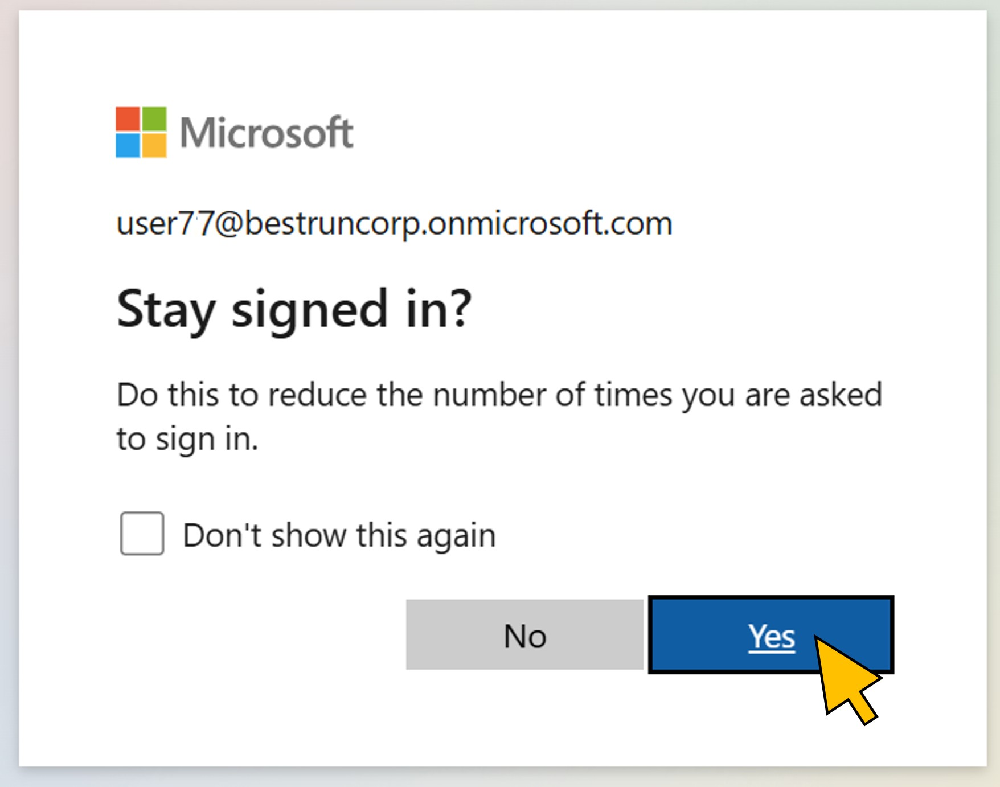
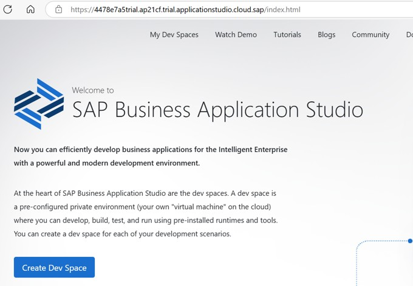

# Exercise 6: Test access to SAP Business Application Studio
Now that the request has been approved, the user is assigned to the resources specified in the access package, i.e. the *SAP BTP Developer* group.
By accessing SAP Business Application Studio, the user is delegated to the SAP Identity Authentication Service tenant, which proxies the request to the corporate IDP, Microsoft Entra. After successful authentication, Entra emits the user token containing the group membership for *SAP BTP Developer*. The group ID is mapped to the required role in BTP which now permits access. 

**Duration:** 5 minutes.

| Step   | Description     | Screenshot          |
| :----- | :-------------- | :-----------------: |
| 6.1    |Start a new **incognito browser window**.<br><br>Open the URL ```https://4478e7a5trial.ap21cf.trial.applicationstudio.cloud.sap/```|<a href="./img/6-1.jpg" target="_blank"></a>|
| 6.2    |Login with your account *user\<41..70\>@bestruncorp.onmicrosoft.com*.|<a href="./img/6-2.jpg" target="_blank"></a>|
| 6.3    |Enter your password.<br><br>Click **Sign in**.|<a href="./img/6-3.jpg" target="_blank"></a>|
| 6.4    |Confirm with **Yes**.|<a href="./img/6-4.jpg" target="_blank"></a>|
| 6.5    |With the group membership approved and assigned to your user, access to SAP Business Application Studio is now granted.<br><br>**Close** the incognito window.|<a href="./img/6-5.jpg" target="_blank"></a>|

Congratulations! You've successfully completed the hands-on session. If you want to explore more IDM workflow and customization options with Microsoft Entra, continue with the optional [exercise 7](../ex7/ex7.md), or go back to the [overview](../README.md).
