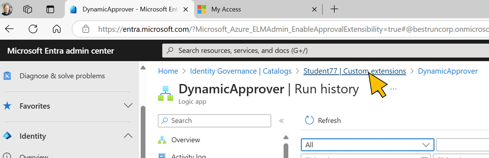
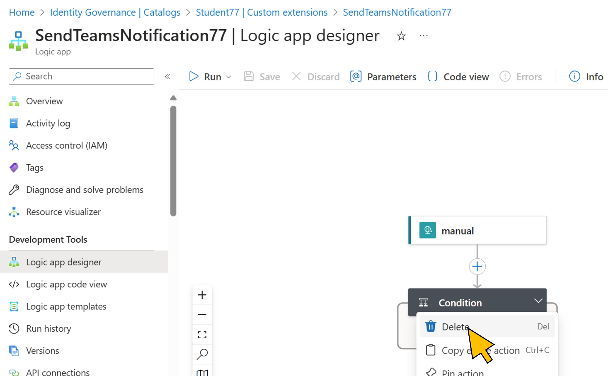
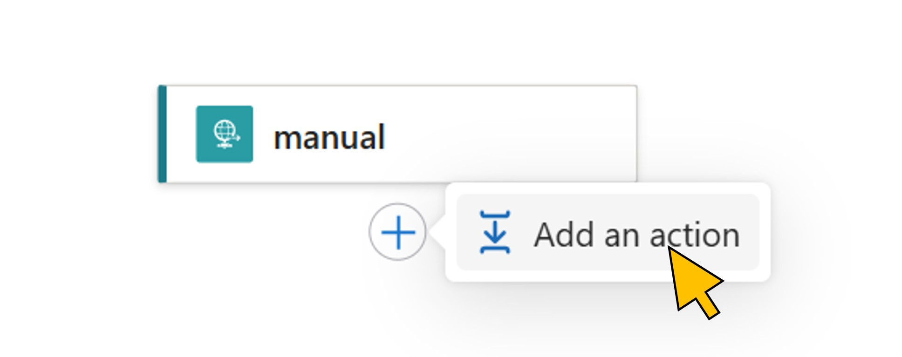

# Exercise 7 (**optional**): Inform the SOC team via Microsoft Teams
In this optional exercise, you can further enhance your skills in IAM worklow design with Entra ID Governance. To inform BestRun's Security Operations Center (SOC) team about any changes in priviledged roles such as developer access, a notification to the SOC's channel in Microsoft Teams should be send. 
You will implement this new workflow requirement with another Logic App that will be called by the correspondog events (access request approved, and access assignment removed).

| Step   | Description     | Screenshot          |
| :----- | :-------------- | :-----------------: |
| 7.1    |Lorem Ipsum      ||
| 7.2    |Lorem Ipsum      ||
| 7.3    |Lorem Ipsum      ||
| 7.4    |Lorem Ipsum      ||
| 7.5    |Lorem Ipsum      ||
| 7.6    |Lorem Ipsum      ||
| 7.7    |Lorem Ipsum      ||
| 7.8    |Lorem Ipsum      ||
| 7.9    |Lorem Ipsum      ||
| 7.10   |Lorem Ipsum      ||
| 7.11   |Lorem Ipsum      ||
| 7.12   |Lorem Ipsum      ||
| 7.13   |Lorem Ipsum      ||
| 7.14   |Lorem Ipsum      ||
| 7.15   |Lorem Ipsum      ||
| 7.16   |Lorem Ipsum      ||
| 7.17   |Lorem Ipsum      ||
| 7.18   |Lorem Ipsum      ||
| 7.19   |Lorem Ipsum      ||
| 7.20   |Lorem Ipsum      ||
| 7.21   |Lorem Ipsum      ||
| 7.22   |Lorem Ipsum      ||
| 7.23   |Lorem Ipsum      ||
| 7.24   |Lorem Ipsum      ||
| 7.25   |Lorem Ipsum      ||
| 7.26   |Lorem Ipsum      ||
| 7.27   |Lorem Ipsum      ||
| 7.28   |Lorem Ipsum      ||
