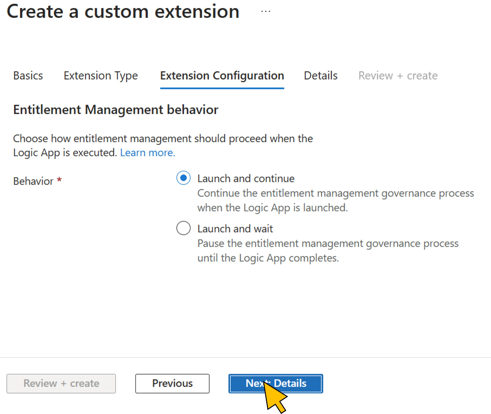
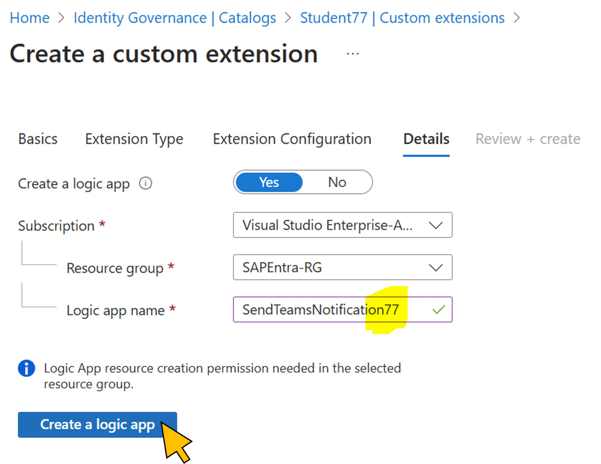
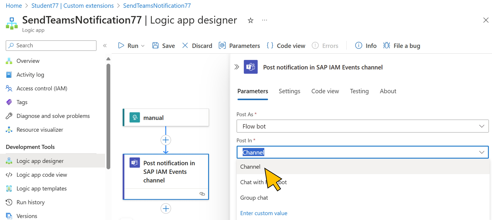
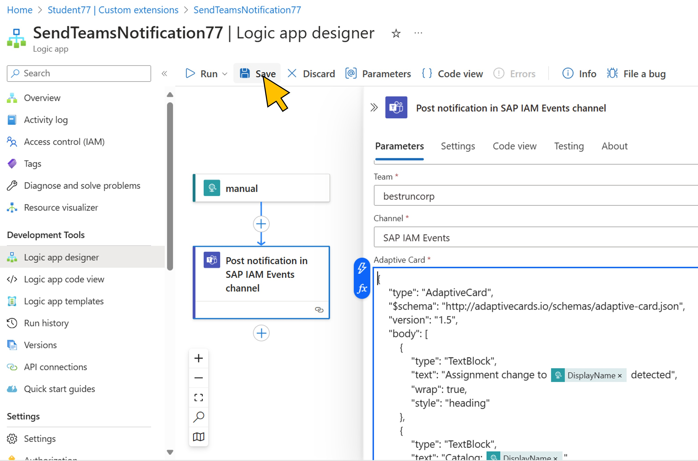
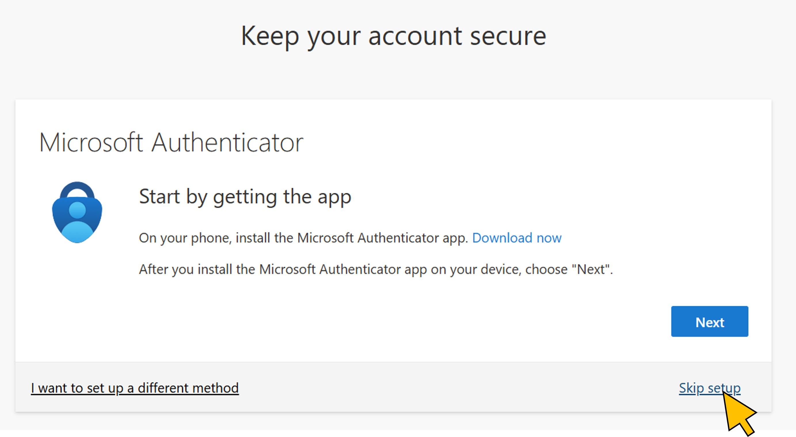
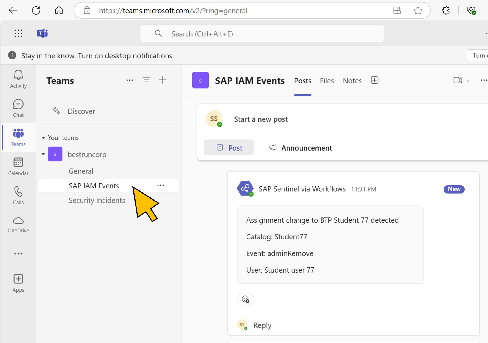

# Exercise 7 (**optional**): Inform the SOC team via Microsoft Teams
In this optional exercise, you can further enhance your skills in IAM worklow design with Entra ID Governance. To inform BestRun's Security Operations Center (SOC) team about any changes in priviledged roles such as developer access, a notification to the SOC's channel in Microsoft Teams should be send. 
You will implement this new workflow requirement with another Logic App that will be called by the corresponding events (access request approved, and access assignment removed).

**Duration:** 15 minutes.

| Step   | Description     | Screenshot          |
| :----- | :-------------- | :-----------------: |
| 7.1    |Go back to the **first browser tab**.  Click **Student\<NN\> \| Custom extensions** from the breadcrumb naviation.||
| 7.2    |Click **+ Add a custom extension**.||
| 7.3    |Enter a name for the new extension, for example **SendTeamsNotification**, and enter a description.  Click **Next: Extension Type**.||
| 7.4    |Select **Request workflow** for the *Extension Type*.  Click **Next: Extension Configuration**.||
| 7.5    |Select **Launch and continue** for the *Behavior* of the new logic app.  The entitlement management governance process is not required to wait for the response from the new extension and can continue immediately.  Click **Next: Details**||
| 7.6    |Leave the switch to **Yes** because you will create a new logic app for the extension. Select *Visual Studio Enterprise Abonnement* for the **Subscription**, *SAPEntra-RG* for the *Resource Group*.  Enter *SendTeamsNotification\<NN\>* as the **Logic app name**. Replace *NN* with the number you are assigned to.  Click **Create a logic app**.||
| 7.7    |Wait for the message that your new logic app has been deployed successfully.  Click **Next: Review + create**.||
| 7.8    |Review the setting for the new custom extension, then click **Create**.||
| 7.9    |From the list of custom extensions, select the newly created logic app **SendTeamsNotification\<NN\>**.||
| 7.10   |Go to the **Logic app designer** in the navigation menue.  *Right-click** on the *Condition* action in the logic app, and select **Delete** from the context menu.||
| 7.11   |Click **+** and select **Add an action**.||
| 7.12   |In the *Search Bar*, filter for *Teams*.  Click the **See more** link for **Microsoft Teams** actions in the search results.||
| 7.13   |Select the **Post *card* in a chat or channel** action from **Microsoft Teams**.||
| 7.14   |Click on the title and change it, for example *Post notification in SAP IAM Events channel*.  Select **Channel** from the **Post In** drop-down list.||
| 7.15   |Select **SAP IAM Events** from the **Channels** drop-down list.||
| 7.16   |In the **Adaptive Card** entry field, copy and past the content from the file [teamsAdaptiveCard.json](../files/teamsAdaptiveCard.json).  Click **Save**.  This [*Adaptive Card*](https://adaptivecards.io/) template takes the values received from the **manual** trigger event, such as the name of the access package or the user name, and sends this information nicely rendered to the selected Teams channel.||
| 7.17   |Select **Student\<NN\> \| Custom Extensions** from the breadcrumb navigation.||
| 7.18   |Select **Access packages** from the navigation menu. Select the **BTP Student \<NN\>** package from the list.||
| 7.19   |Select **Policies** from the navigation menu. Select the **Initial Policy** assignment policy from the list.||
| 7.20   |In the **Policy details** section, clicL **Edit**.||
| 7.21   |Switch to the **Custom extensions** tab.  Select *Request is approved* for the **Stage**.||
| 7.22   |Select *SendTeamsNotification* for the **Custom Extension**.  On the second line, select *Assignment is removed* for the **Stage**.||
| 7.23   |Select *SendTeamsNotification* for the **Custom Extension**.  On the second line, select *Assignment is removed* for the **Stage**.||
| 7.24   |Again, select *SendTeamsNotification* for the **Custom Extension**.  Click **Update**.||
| 7.25   |Select **Assignments** from the navigation menu.  Activate the checkbox for the existing assignment to your *Student user \<NN\>*.  Click **Remove**. This will trigger the new logic app to send a notification into the SOC team's event channel.||
| 7.26   |Verify that the event information has been sent.  Open a *new incognito windows**.  Login to [Microsoft Teams](https://teams.microsoft.com/) with user *sapsentinel@bestruncorp.onmicrosoft.com*.  Click **Next**.||
| 7.27   |Click **Skip for now**.||
| 7.28   |Click **Next**.||
| 7.29   |Select **SAP Sentinel** from the account list.||
| 7.30   |Select **Skip for now**.||
| 7.31   |Select **Skip setup**.||
| 7.32   |Click **Yes**.||
| 7.33   |In Microsoft Teams, switch to **Teams** on the left-side navigation. Expand the *bestruncorp* team, and select the **SAP IAM Events** channel from it.  Verify that the adaptive card has been sent by your new custom extension and informs about the removal of the assignment.||
