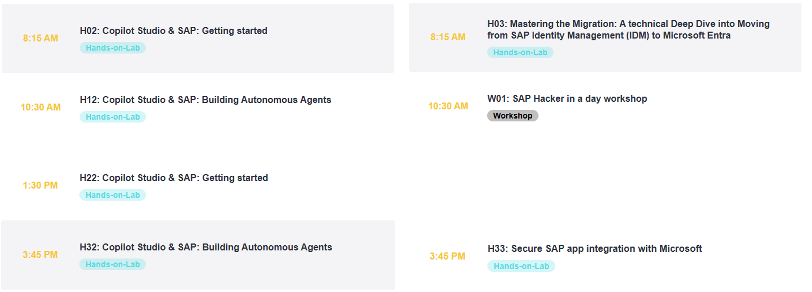

# 🌌DSAG TechXChange 2025 - Microsoft track📎

Welcome to your **SAP with Microsoft hands-on lab** experience! This repos gets you all setup to embark on your assigned epic quest. Excited yet? This is the line up including the lectures taking place on the [4th of April 2025](https://dsag.de/events/techxchange25/):

Find us on-site in Wiesbaden. We are looking forward to meeting you in person! 🤝

## Introduction

| Lab             | Dungeon entry  | Description |
| ---------------- | -------- | -------- |
| Copilot - getting started | 👉[🏰](./1-copilot-getting-started/README.md) | Learn how to build. |
| Copilot - agents | 👉[⛩️](./2-copilot-agents/README.md) | Learn how to |
| SAP data integration with Microsoft Fabric | 👉[🧙](./3-sap-msft-fabric-integration/README.md) | Learn how to build |
| Hack SAP in 2 hours - SAP ETD joins Sentinel | 👉[🧙](./4-sap-etd-sentinel-integration/README.md) | Learn how to build |
| Unleash Makers - Enable SAP Principal Propagation for Power Platform | 👉[🧙](./5-power-platform-sap-principal-propagation/README.md) | Learn how to build |
| Deploy first SAP IDM scenario to Microsoft Entra ID | 👉[🧙]() | Learn how to build |

Partner featured sessions 

> [!TIP]
>🏆Finish the final quest, collect the pass phrase, and redeem it to claim [your badge](https://webhostingforconverter.z16.web.core.windows.net/claim-reward.html) 😎

## Recommended courses and further learning

* [AI-For-Beginners](https://microsoft.github.io/AI-For-Beginners/)

## 📢Feedback

This repos encourages contributions and feedback via the [GitHub Issues](https://github.com/MartinPankraz/DSAGTechXChange25/issues/new/choose).

## 🚸 Your Adventure Guides

| Name             | Company  |
| ---------------- | -------- |
| [Holger Bruchelt](https://www.linkedin.com/in/holger-bruchelt/)  | Microsoft |
| [Martin Raepple](https://www.linkedin.com/in/martinraepple/)   | Microsoft |
| [Martin Pankraz](https://www.linkedin.com/in/martin-pankraz/)   | Microsoft |
